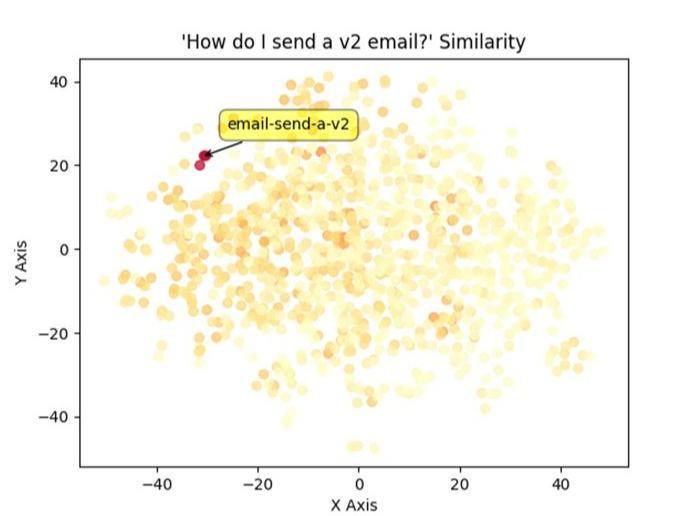

Comparing and classifying text can be a very time-consuming process, especially when dealing with large volumes of data. However, did you know that you can streamline this process using embeddings?  

By leveraging embeddings, you can efficiently compare, categorize, and even cluster text based on their underlying meanings, making your text analysis not only faster but also more accurate and insightful. Whether you're working with simple keyword matching or complex natural language processing tasks, embeddings can revolutionize the way you handle textual data.

<!--endintro-->

## What are embeddings?

Embeddings are powerful tools that transform text into numerical representations, capturing the semantic meaning of words, phrases, or entire documents.

It is a way of grouping how similar certain pieces of text are, and take the form of a vector. You can think of an embedding as similar to a point in 2D space with an X and Y coordinate.

The only difference is that they actually have far more dimensions. For example, embeddings generated using OpenAI's embedding models have 1536 dimensions per vector!

## What can embeddings be used for?

* **Document clustering** - Using embeddings you can group documents based on their content without the need to manually read and classify them.

* **Search** - Embeddings can speed up searches by a huge amount given that you can search using the vector value as opposed to text.  
A good example of this is the [SSW RulesGPT bot](https://rulesgpt.ssw.com.au/), which embeds the message you send it and uses the resulting vector to search for rules relevant to your question.

* **Recommendations** - Embedded text can be easily compared based on it's content, making it perfect for recommending things like similar articles or books without the need to manually tag or categorise.

* **Cross-lingual tasks** - When you embed a piece of text the resulting embedding represents the meaning of the text and is not tied to any particular language.  
This means you can use embeddings to compare different language texts without needing to read or translate the text!

## How can embeddings be used?

When you have an embedding for two pieces of text you can perform a mathematical operation called cosine similarity, which measures the distance between the two vectors. The closer they are, the more similar the text.

Many databases such as Cosmos DB, Redis and Pinecone have inbuilt cosine similarity functions, making it easy to quickly compare embeddings.
Other databases such as Postgres have plugins to handle vectors.

## How do we get embeddings?

OpenAI provides specialized embedding models that are accessible via an API, similar to the GPT API. These models are generally cheaper than the GPT models, meaning large amounts of text can be embedded cheaply.

Find [more information on these models and how to access them](https://platform.openai.com/docs/guides/embeddings/embedding-models).

There are also open source and self hosted models available at [Hugging Face](https://huggingface.co/models?other=embeddings).
