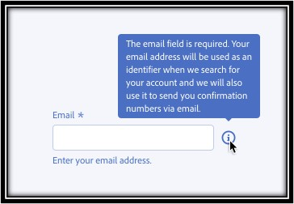
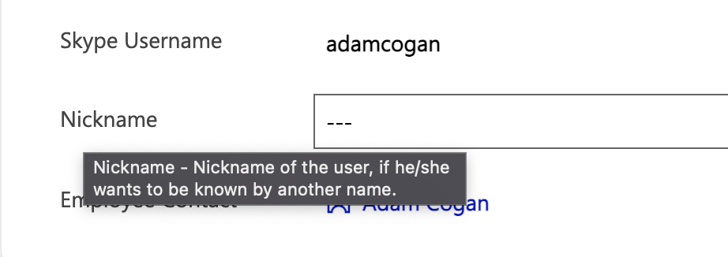
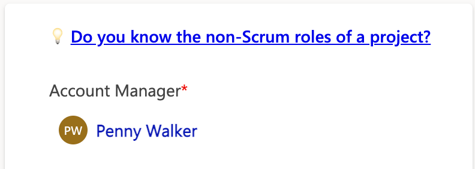
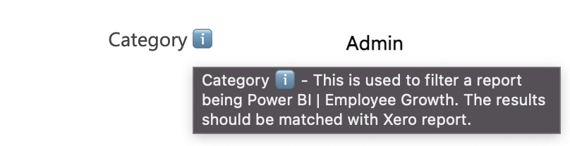

How do you show a tooltip or a note to a Dynamics user?

### Option 1 - Description attribute

Advantages:

* Out of box feature. No customizations needed

Disadvantages:

* Not obvious to see - users are often unaware they can hover on the label to see the note

### Option 2 - PCF control

Advantages:

* Flexibility - can customize any style or behaviour

Disadvantages:

* Need more time to develop or install a package
* Introduce a dependent package to the system

### Option 3 - Description field + Emoji (Recommended)

Add an emoji in the label to remind people to hover to see the tooltip.

