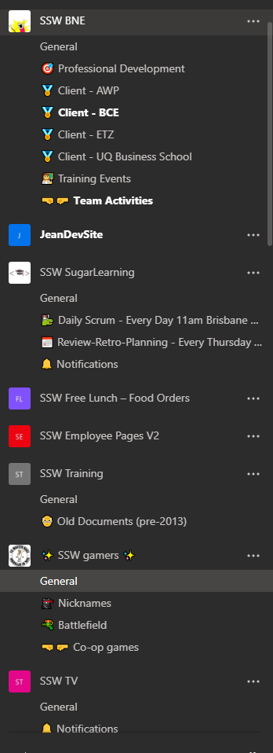

It’s usually easier for users to remember where a given information is when it is associated to an image/icon. This is especially true for non-technical people or the ones that are not very familiar with digital workspaces.

<!--endintro-->

An easy and fun way to alleviate this issue and boost user adoption to Microsoft Teams is to use emojis in your channel names.

::: bad

:::

::: good

:::
