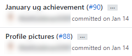
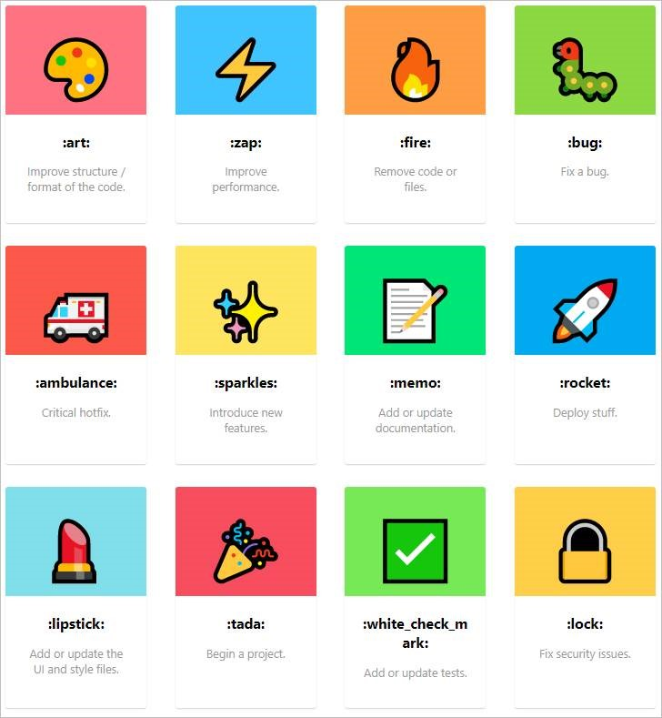

​​​Reading ugly commits is not very pleasant and makes it very confusing when you have to check the commit history. 
<dl class="badImage"><dt>​​</dt><dd>Bad​ Example: The commits have no meaning​​</dd></dl>
 <excerpt class='endintro'></excerpt> 

 
   <iframe width="750" height="422" src="https://www.youtube.com/embed/uBLWVxnPLP4" frameborder="0"></iframe> 
 
​ 

Ways to improve your commit log: 

<h3 class="ssw15-rteElement-H3">Tip #1: Have a nice, concise comment</h3>
Examples:
<ul><li>"Fixed bug with emoji engine" </li><li>"Added new emoji filter" </li><li>"Updated Architecture Diagram to have emojis" </li></ul>

<h3 class="ssw15-rteElement-H3">Tip #2: Using prefixes </h3>
Even better is to add a helpful prefix to categorize your commits.

Examples:
<ul><li>​"Fix: Fixed bug with emoji engine" </li><li>"Feature: Added new emoji filter" </li><li>"Doc: Updated Architecture Diagram to have emojis" </li></ul><h3 class="ssw15-rteElement-H3">Tip #3: Using emojis 💄​​ </h3>
In a text message, emojis helps to add emotion and context to plain text. Why not use them in commit messages too 😃? 

Examples: 

<ul><li>"🐛 Fixed emoji engine in language component" </li><li>"🚀 Added emoji filter on Snapchat"</li><li>"📄 Added emoji’s to changelog" </li></ul>There are a bunch more options to choose from - <a href="https://github.com/carloscuesta/gitmoji">carloscuesta/gitmoji: An emoji guide for your commit messages. 😜 (github.com) </a>

<h3 class="ssw15-rteElement-H3">Tip #4: Using gitmoji VSCode extension</h3>
h <a href="https://marketplace.visualstudio.com/items?itemName=Vtrois.gitmoji-vscode">Gitmoji - Visual Studio Marketplace (visualstudio.com)</a>. 

You can even go 🤘 hardcore and use the <b>gitmoji cli - </b><a href="https://github.com/carloscuesta/gitmoji-cli">carloscuesta/gitmoji-cli: A gitmoji interactive command line tool for using emojis on commits. 💻 (github.com)</a>  
<dl class="goodImage"><dt> 
       
</dt><dt>   </dt><dd>Good Example: Great use of emoji and concise message​</dd></dl><dl class="image"><dt></dt><dd>Figure: see what emojis work best with each topic here: 
<a href="https://gitmoji.carloscuesta.me/">gitmoji.carloscuesta.me/</a></dd></dl>

