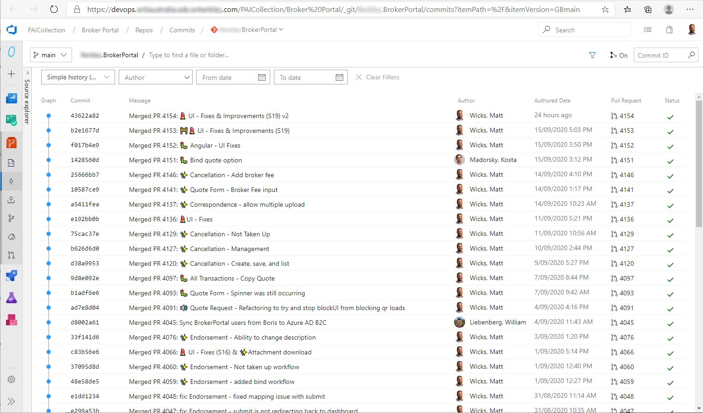

Reading ugly commits is not very pleasant and makes it very confusing when you have to check the commit history.

::: bad  
  
:::

<!--endintro-->

`youtube: https://www.youtube.com/embed/uBLWVxnPLP4`

Here are a few ways to improve your commit log.

### Tip #1: Have a nice, concise comment

Examples:

* Fixed bug with emoji engine
* Added new emoji filter
* Updated Architecture Diagram to have emojis

### Tip #2: Using prefixes

Even better is to add a helpful prefix to categorize your commits.

Examples:

* Fix: Fixed bug with emoji engine
* Feature: Added new emoji filter
* Doc: Updated Architecture Diagram to have emojis

### Tip #3: Using emojis 💄

In a text message, emojis helps to add emotion and context to plain text. Why not use them in commit messages too 😃?

Examples:

* 🐛 BUG - Fixed emoji engine in language component
* 🚀 Feature - Added emoji filter on Snapchat
* 📄 Doc - Added emoji’s to changelog

There are a bunch more options to choose from - [carloscuesta/gitmoji: An emoji guide for your commit messages. 😜 (github.com)](https://github.com/carloscuesta/gitmoji)

### Tip #4: Using gitmoji VSCode extension

[Gitmoji - Visual Studio Marketplace (visualstudio.com)](https://marketplace.visualstudio.com/items?itemName=seatonjiang.gitmoji-vscode).

You can even go 🤘 hardcore and use the  **gitmoji cli -** [carloscuesta/gitmoji-cli: A gitmoji interactive command line tool for using emojis on commits. 💻 (github.com)](https://github.com/carloscuesta/gitmoji-cli)

::: good  
  
:::

See what emojis work best with each topic here: [https://gitmoji.dev/](https://gitmoji.dev/)

