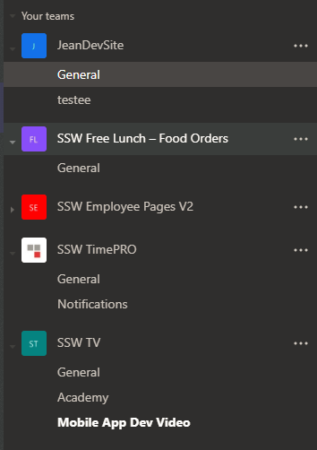
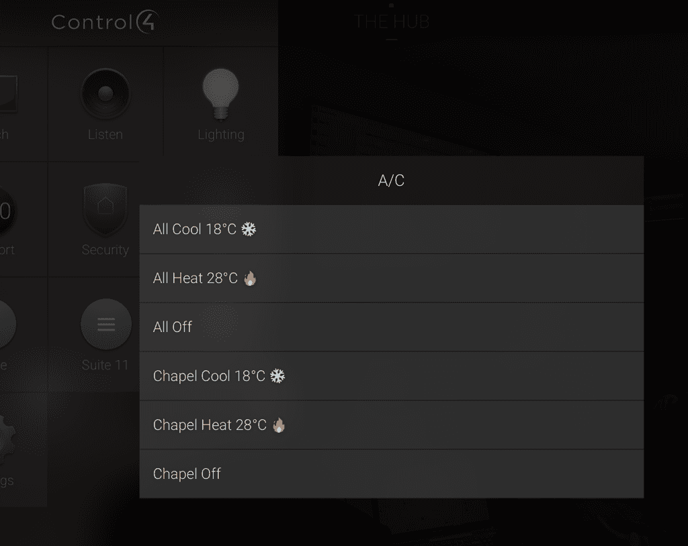
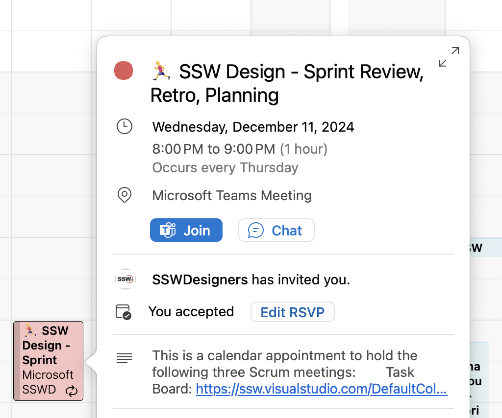

It's usually easier for users to remember where given information is when it is associated with an image/icon. This is especially true for non-technical people or the ones that are not very familiar with digital workspaces.

<!--endintro-->

An easy and fun way to alleviate this issue and boost user adoption to Microsoft Teams is to use Emojis in your channel names (using **Windows Key** + **.**)!

::: bad  
  
:::

::: good  
  
:::

::: good  

:::

::: good  
  
:::

::: greybox
* Fast to load (lightweight as no image)
* UI - Consistent look
* Maintenance of needing to upload to server
:::
::: bad
Bad example - Regular list items
:::

**Tip:** Always remember to add a space between the emoji and text, for better readability.

::: greybox
✅ Fast to load (lightweight as no image)  
✅ UI - Consistent look  
❌ Maintenance of needing to upload to server  
:::
::: good
Good example - Emojis give context to each item
:::

