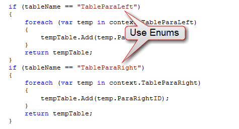

Use Enums instead of hard-coded strings, it makes your code lot <strong>cleaner</strong> and is <strong>really easy to manage</strong>.  

 <excerpt class='endintro'></excerpt> 
<dl class="badImage"><dt> </dt><dd>Figure: Bad example - "Hard- coded string" works, but is a bad idea</dd></dl><dl class="goodImage"><dt></dt><dd>Figure: Good example - Used Enums, looks good and is easy to manage </dd></dl>

