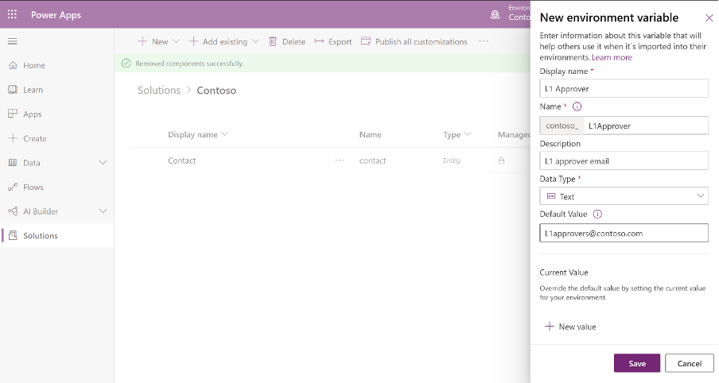

If your Power Apps solution has any environment-specific configuration items, then an Environment Variable in the Solution gives you a configurable input parameter. Environment variables avoid hardcoding configuration information and having to keep track of and change configuration data when importing a solution.​​ 

 <excerpt class='endintro'></excerpt> 

​Some of the benefits of using environment variables are: ​ 

<ul>
   <li>No need to manually edit configurable values in a production environment. </li><li>Configure one or more variables in one place and reference like a parameter across multiple solution components. </li><li>Enter different values while importing solutions to other environments. </li><li>Update values without a code change. </li><li>Granular level security managed by Common Data Service. </li><li>Unlimited number of variables (max solution size is 29 MB). </li><li>Service the definitions and the values independently or together. </li><li>Supported by Solution Packager and DevOps tools enable continuous integration and continuous delivery (CI/CD). </li><li>Support for localization. </li><li>Can be used to control feature flags and other application settings. </li></ul><dl class="image"><dt></dt><dd>Figure: Environment variable make configuration information easy</dd></dl>
More information here: <a href="https://docs.microsoft.com/en-us/powerapps/maker/common-data-service/environmentvariables">https://docs.microsoft.com/en-us/powerapps/maker/common-data-service/environmentvariables</a>

