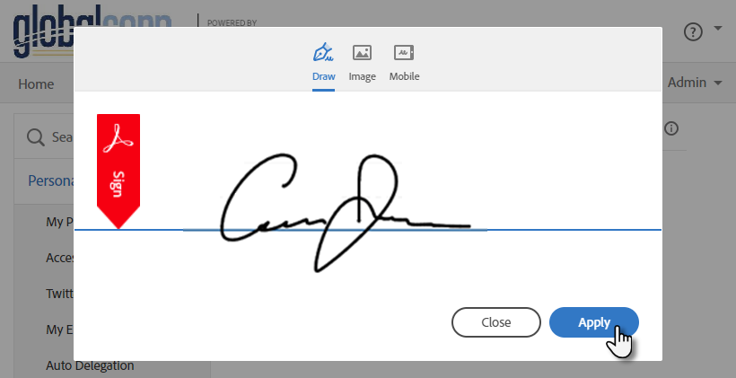

The age of printing, signing, scanning, and sending documents manually is far behind us. You've just been emailed an important contract and are expected to sign it within the hour. The issue? You're nowhere near a printer or scanner. This is where eSignature solutions come into play. They help expedite such processes with increased efficiency and security.

Let's talk about pros and cons of the main solutions.

<!--endintro-->

## Compare DocuSign vs Adobe Sign

Both DocuSign and Adobe Sign are leading eSignature platforms, but they have distinct features and benefits:

| Features         | DocuSign                                                          | Adobe Sign                                                               |
| ---------------- | ----------------------------------------------------------------- | ------------------------------------------------------------------------ |
| User Interface   | ✅ Great user-friendly interface                                  | ✅ Great user-friendly interface                                          |
| Templates        | ✅ Offers customizable templates                                   | ✅ Offers customizable templates                                          |
| Integrations     | ✅ Most integrations with business software E.g. Dynamics 365     | ✅ Many integrations with business software E.g. Dynamics 365             |
| Cost             | ✅ $49 per standard user per month (or $348 annually when prepaid) | ✅ $32.99 per standard user per month (or $224.27 annually when prepaid) |
| Branding         | ✅ Included in the standard license                                | ❌ Not included in the standard license                                   |
| Analytics        | ✅ Powerful reporting and analytics                               | ✅ Powerful reporting and analytics                                       |
| Document Editing | ✅ Allows users to make minor edits to the document before signing | ✅ Allows users to make minor edits to the document before signing        |
| Cloud Storage    | ✅ Integrations with Google Drive, Dropbox and more                | ✅ Integrations with Google Drive, Dropbox and Adobe Cloud               |
| Authentication   | ✅ Two-step verification enabled                                   | ✅ Two-step verification enabled                                          |

## Benefits of eSignature Solutions

* **Speed** - Eliminates the delay caused by printing, signing manually, and scanning
* **Efficiency** - Streamlines processes and reduces the need for physical paperwork
* **Security** - Ensures encrypted digital signatures, making it more secure than physical signatures
* **Accessibility** - Sign documents from anywhere at any time using any device

## Implementation Process

When implementing an eSignature solution:

1. **Choose the right platform** - Based on your business needs, select between solutions like DocuSign or Adobe Sign
2. **Identify Use Cases** - Determine all the instances and departments within your organization where eSignature solutions can be used. This can range from HR and legal to sales and external communications
3. **Determine User Needs** - Estimate how many users will need access to the eSignature platform (E.g. in a company of 100 people, you might only need 2 users)
4. **Cost Estimation** - Once you've determined the number of users, assess the cost implications (E.g. 2 users are around AUD 700 per annum)
5. **Setup** - Follow the step-by-step guidelines provided by the chosen platform. Consider registering the license on a shared email account (E.g. `Projects@Northwind.com` or `Accounts@Northwind.com`)   
   **Note:** Do not share sensitive documents on a shared email account without ensuring data confidentiality
6. **Integration** - Integrate the solution with your existing software and tools for seamless operation (E.g. Microsoft Teams and Dynamics 365)
7. **Internal Documentation** - Create detailed internal documents or guides on how to use the app. This ensures consistency in usage and helps new users get onboarded quickly
