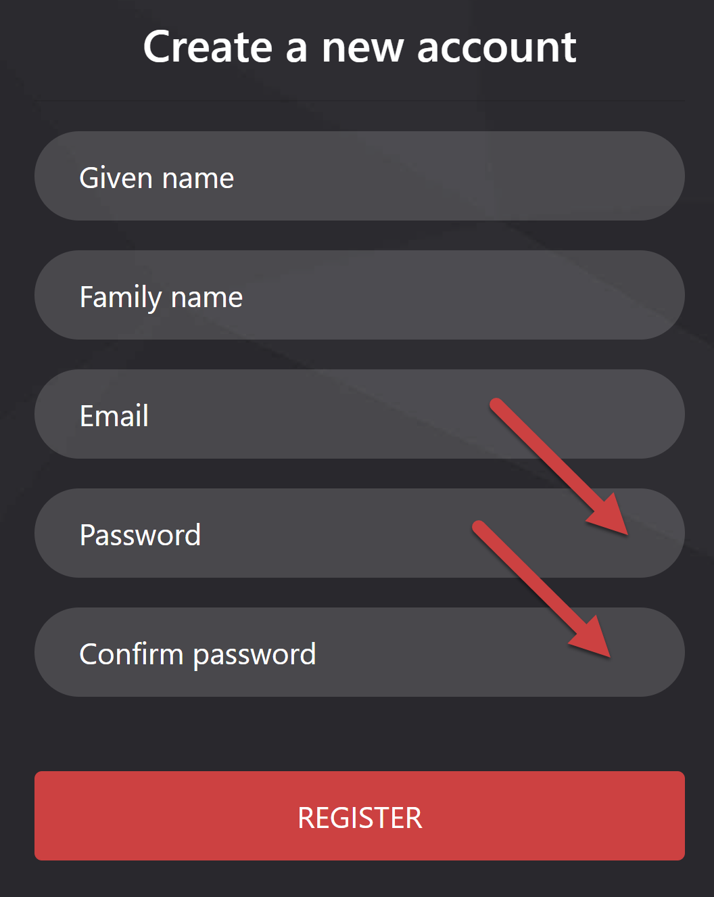
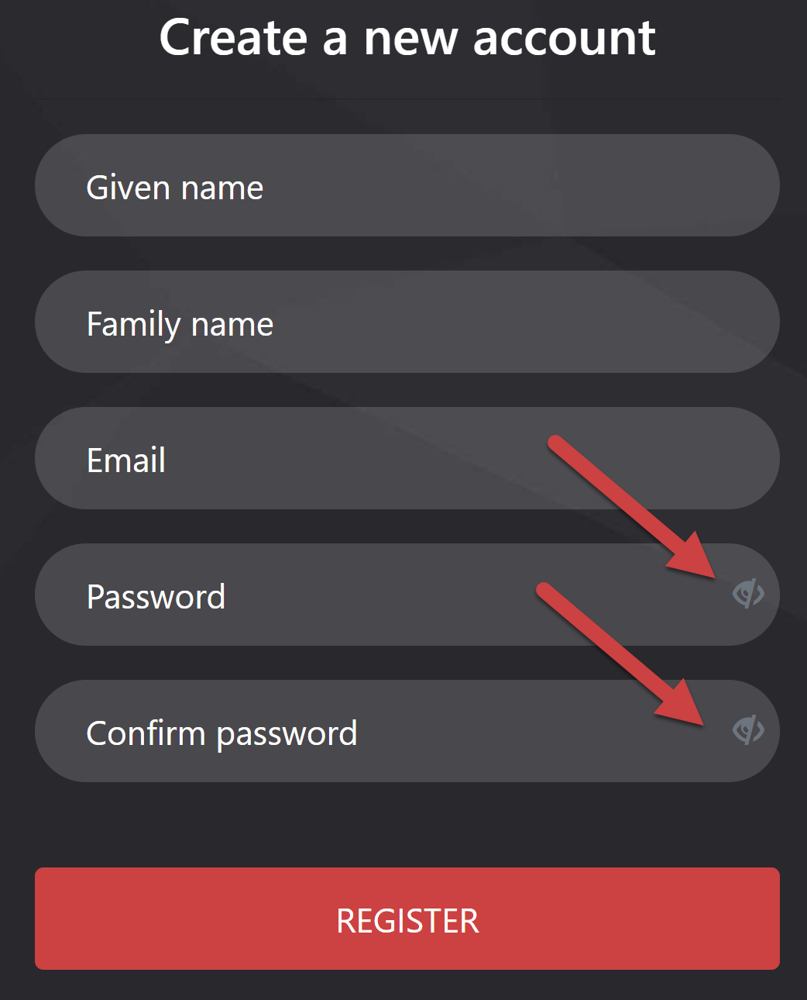

When users create a password during sign-up, they often make mistakes due to typos, especially on mobile devices. This can lead to frustration, failed login attempts, and the need to reset passwords, creating a poor user experience.

<!--endintro-->

Adding an eye toggle icon solves this problem by allowing users to verify their password before submission. This simple feature reduces errors, minimizes the likelihood of password resets, and enhances usability and accessibility without compromising security.

::: bad  
  
:::

::: good  

:::
