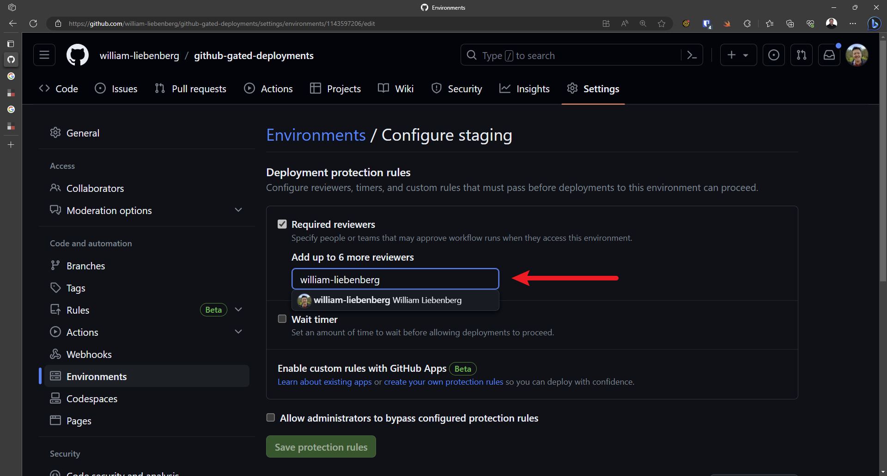
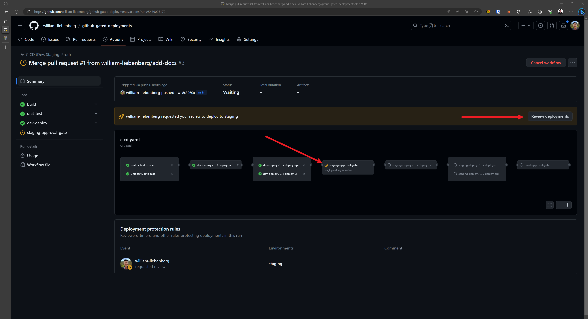
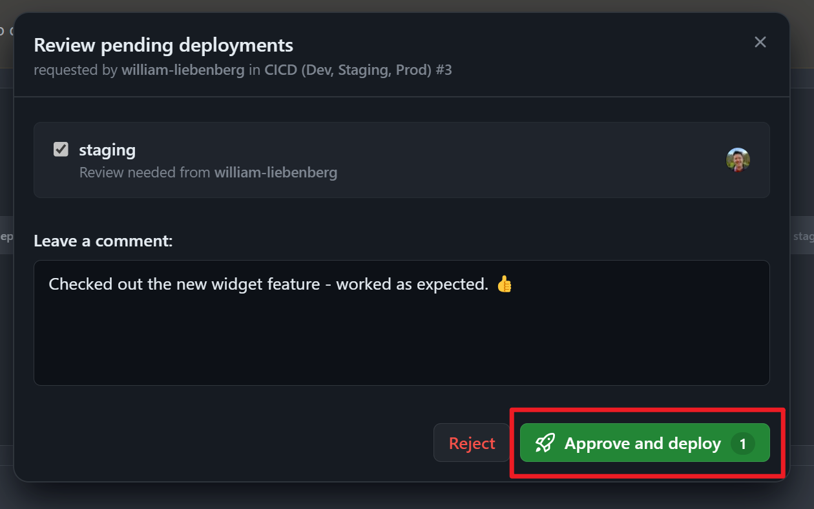

In a blazing-fast CI/CD pipeline, we've got everything automated for maximum efficiency! From building, testing and finally deploying our code. But sometimes we need to pause prior to large operations such as deployments and make sure that they are manually approved by someone with insight and oversight.

<!--endintro-->

GitHub enables us to add manual approval steps in our workflow via the [environments](https://docs.github.com/en/actions/deployment/targeting-different-environments/using-environments-for-deployment) feature.

Environments also allow us to add per-environment secrets, timers, and protection rules. To use environments we have to consider if our repository is:

- **Public** - awesome! all public repo's have the environments feature enabled
- **Private** - environments is only enabled for private repos on GitHub Pro, Team, Enterprise pricing tiers

Only repository administrators can configure environments reviewers, timers, and secrets.

Once approvals are configured, and a deployment workflow is triggered the GitHub workflow will pause on an approval step and notify the required approvers to manually review the deployment. Reviewers can approve or reject the deployment and add any comments if necessary. Once a deployment is approved, the GitHub workflow will continue running.

GitHub will also display the review information in the deployment summary.

## Example workflow

For most projects we create multiple environments such as `dev`, `staging`, and `prod`. You can add as many environments as needed to suit your team or project.

Here is a high-level workflow for building and deploying a project:

1. In Parallel:
   - Build the .NET WebAPI application
   - Build the UI application
   - Run Unit Test
2. Automatically deploy the applications to `dev`
3. After review and manual approval by Release Master, deploy the applications to `staging`
4. After review and manual approval by Release Master, deploy the applications to `prod`

The Release Master can use the approvals to control the number of changes released into the Staging environment for QA / Testers and to not disrupt the current testing efforts.

The manual approval steps also allows the Release Master to prevent any known issues with the application from being released to the real-life users in the Production environment.

Here is an example of a workflow waiting for manual approval from a required reviewer before deploying to the `staging` environment:

Once the reviewer is notified, they can manually approve which will then let the deployment process continue.

Check out the [sample repo](https://github.com/william-liebenberg/github-gated-deployments) for an example GitHub workflow with gated deployments.
