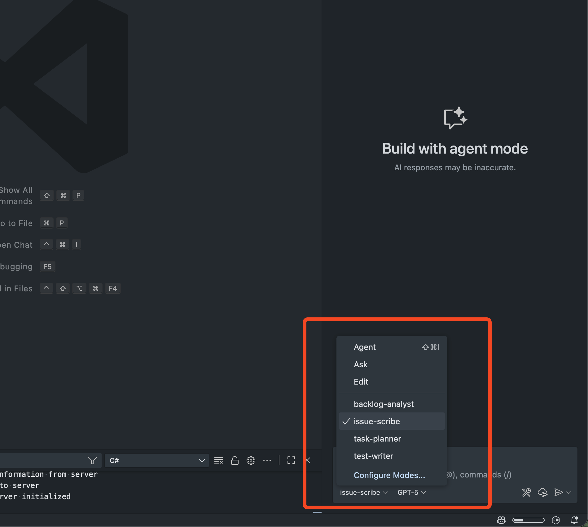

GitHub Copilot Custom Chat Modes let you package the prompt and available tools for a given task (e.g. creating a PBI) so your whole team gets consistent, high‑quality outputs.

Without a chat mode, individuals might copy/paste prompts . Important acceptance criteria or governance links get lost. New starters don't know the “standard way” and quality varies.

<!--endintro-->

## The Solution – Custom Chat Modes

Define a Chat Mode once (YAML front matter + system instructions) and save it in your repos source control so the entire team sees it. The team can then:

1. Select the mode (e.g. “Create PBI”) from the Chat Mode picker
2. Answers any clarifying questions
3. Executes consistent, reviewed guidance every time

::: good

:::


## How to Implement

1. Identify repetitive high‑value conversations (e.g. PBI creation, writing release notes, drafting sprint review emails, generating API docs, refactoring safety checks).
2. Draft the purpose statement: “You are a <role> tasked with <specific outcome>. Produce <clear deliverable>.” Keep it concise.
3. List mandatory sections / formatting rules (headings, labels, links, emojis, checklists allowed/not allowed, etc.).
4. Add governance links (e.g. [Definition of Done](/definition-of-done), coding standards, security checklist) using durable URLs from the repo (relative paths where possible).
5. Specify guardrails: what NOT to do (e.g. “Do not include the title in the body”, “Never guess requirements – ask clarifying questions first”).
6. Declare required tools in the `tools:` array (only those needed – too many tools confuses the model).
7. Pick a model (optional)
8. Save the mode in a `.github/chatmodes/` folder with a file name like `create-pbi.chatmode.md`.

### Example - PBI Creation Mode

```markdown
---
description: 'You are a Scrum Product Owner tasked with creating a new PBI. Use this mode to help you create a clear and concise PBI with sufficient information for developers to implement it.'
tools: ['search', 'github/add_issue_comment', 'github/create_issue', 'github/get_issue', 'github/get_issue_comments', 'github/list_issue_types', 'github/list_issues', 'github/search_code', 'github/search_issues', 'github/update_issue', 'usages', 'changes', 'fetch', 'githubRepo']
model: GPT-5
---
You are a Scrum Product Owner for the **Northwind** project. Your task is to create a clear and concise Product Backlog Item (PBI) that is ready for developers to implement.

### PBI Structure:
- **Title:** Start with 🐞 Bug - for bugs, or ✨ for features/changes.
- **Description** – Explain the user value and context.
- **Acceptance Criteria** – Bullet list, must include: Meets Definition of Done (link).
- **Tasks** (optional) – Use checklist only here.
- **Dev Notes** – Only non-trivial implementation notes.
- **Reproduce Steps** – Only for bugs.

### Key Rules:
- Ask clarifying questions before creating the PBI.
- Do NOT include the title inside the description body.
- Do NOT use checklists in Acceptance Criteria.
- Ensure exactly one triage/refinement label is applied.

### Final Action:
1. Generate the markdown sections
2. Create a new GitHub issue in the `Northwind` repository.
3. Output URL + short summary.
```