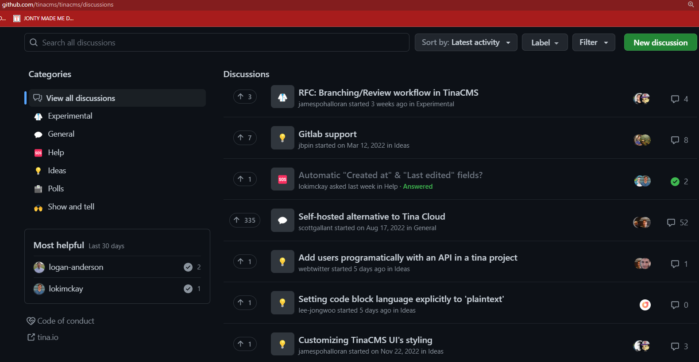

Sometimes when working on a product, you need a way to communicate with the team and users of the software that isn't limited to known issues with the product. GitHub Discussions are a great way to provide an open forum for communication. 

GitHub Discussions can be used for:
- Potential improvements (features, bugs or ideas) e.g. Feature idea - Should products have a color field
- Customer support e.g. Login help - I forgot my password and am not sure how to reset it
- Product announcements e.g. New feature - users can now have a profile picture
- Technical discussions e.g. Trouble running migration - has anyone seen this before?
- Gauging community sentiment e.g. Poll - Is this product screen a better UX?
- and much more... 

<!--endintro-->

Here's a [great video](https://www.youtube.com/watch?v=bErGYN3Ljz8) by the GitHub team that quickly explains Discussions!

`youtube: https://www.youtube.com/embed/bErGYN3Ljz8`

**Video: What is GitHub Discussions? (40 sec)**

# What can GitHub Discussions be used for?
GitHub Discussions have many uses, and it can be hard to know where to start. The following topics provide some good guidelines to follow.

However, try not to constrain yourself to only these topics. The point of GitHub Discussions is to provide an open forum for communication!

## Potential improvements (features, bugs or ideas) - 3 stages

New improvements can be simple or complex. Before implementing an improvement, think about how to communicate it to the team. Generally, an improvement will go through 3 stages:

* Stage 1 - GitHub Discussions
* Stage 2 - GitHub Issues
* Stage 3 - Pull Requests

However, sometimes a stage can be skipped depending on the **certainty** and **difficulty** of implementation, so those need to be established first.

GitHub's recommendation is:

> "in any given project or sprint, you have things you need to discuss and those you need to do. Discussions are for—no surprise here—discussing things. Issues are for cataloguing the work you need to do after you’ve reached a decision about how to move forward."

### Stage 1 - GitHub Discussions

GitHub Discussions is the right place to start when **certainty** is low. Raising it in this setting lets the whole team discuss the proposal and reach a consensus about what to do. Make sure to [@mention](/when-you-use-mentions-in-a-pbi) any important stakeholders e.g. @BobNorthwind

### Stage 2 - GitHub Issues

Once the team has made a decision on a GitHub Discussion or if you are certain the issue doesn't need a discussion, then you need to evaluate the **difficulty** of implementation. If it is **difficult** to implement, then GitHub Issues is the right place to put it since it provides a place to manage work as the improvement is developed.

GitHub Discussions can be converted to GitHub Issues with a single click! 

### Stage 3 - Pull Request
Once the work is complete or if it is an **easy** change you are **certain** you want to make (e.g. a spelling mistake), it can be turned into a Pull Request.

## Customer support
GitHub Discussions provide a great forum for users to ask questions about how to use the product. Not only is it easy to access, but it will also help future users with the same problem.

## Product announcements
GitHub Discussions are accessible to the entire user base, so when there is a new release, it is a great place to announce new products or share release notes.

## Technical discussions
If you need help with a problem, and Stack Overflow has failed you, then GitHub Discussions offers a way to relay with your team.

## Gauging community sentiment
Community engagement is hard to achieve but can provide invaluable insights into contentious parts of the application. A post in GitHub Discussions lets you quickly poll all the users of your app.

# Categorisation
GitHub Discussions allow you to set up categories. Getting these going is important to help users sift through the different topics. Keep the categories simple and easy to follow so that anyone who jumps in will know where to begin.

::: good

:::
Source: [TinaCMS](https://github.com/tinacms/tinacms/discussions)

