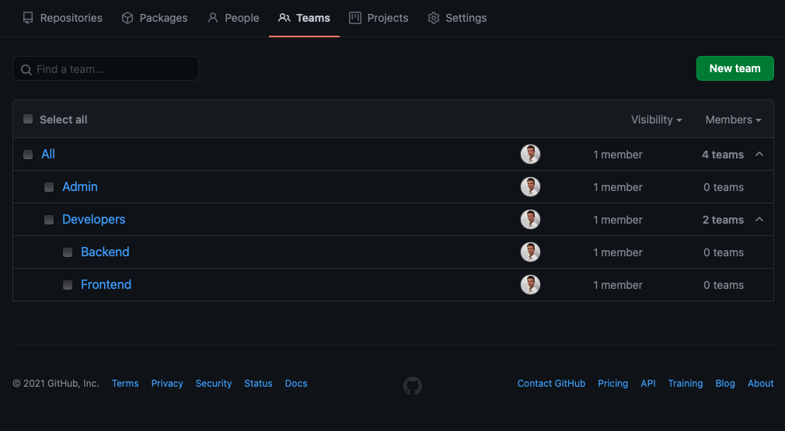
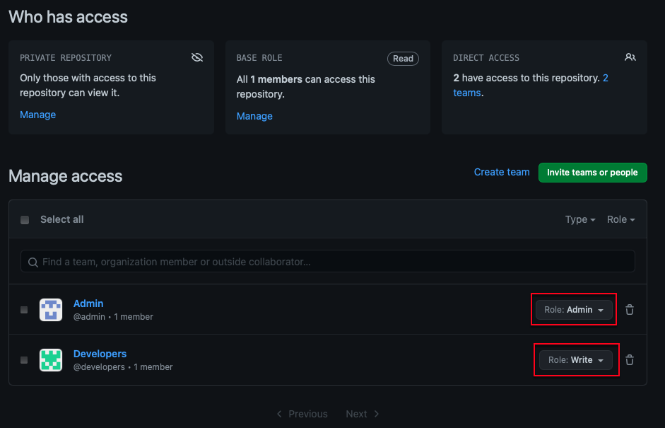
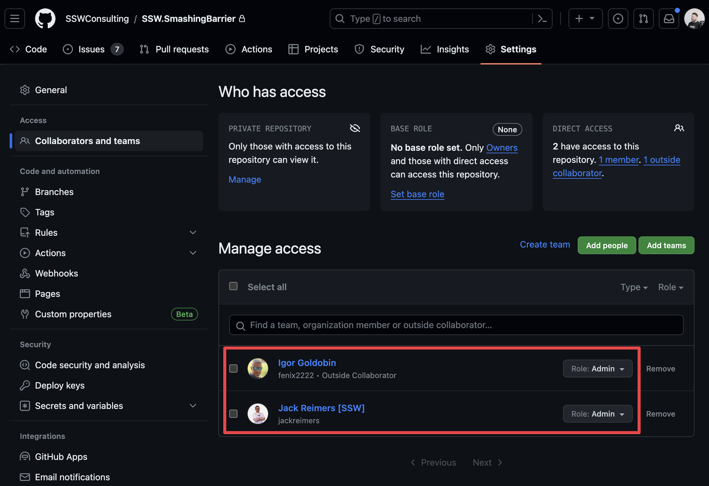
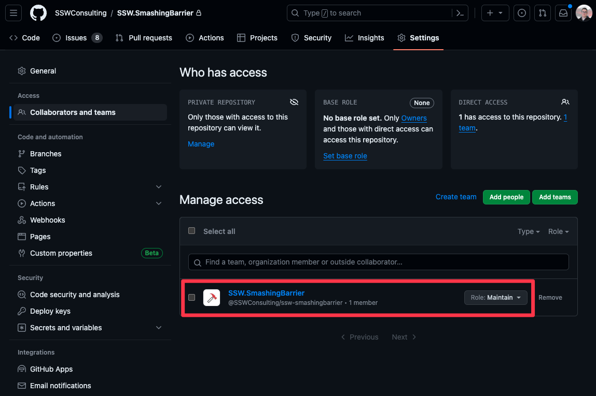

You can use teams within a repository to manage a whole group's permissions instead of setting permissions for each new member of the organisation.

See [Organizing members into teams](https://docs.github.com/en/github/setting-up-and-managing-organizations-and-teams/organizing-members-into-teams).

::: good

:::

Correctly configuring your organisation's teams structure will make it easy to give members the permissions level that they need. You can add teams to repositories to manage their roles.

::: good

:::

<!--endintro-->

Another benefit of using teams is that you can mention a whole team in a discussion instead of individual members. See [Mentioning people and teams](https://docs.github.com/en/github/writing-on-github/basic-writing-and-formatting-syntax#mentioning-people-and-teams)

#### Use teams as maintainers over individuals

When you add a team to a repository, you can give the team a role that determines their access level to the repository. You can also add teams to issues and pull requests to manage their access to those resources. Often individuals are added to repositories as administrators, but this is not a good idea as it gives them destructive access to the repository. Instead, add a team to the repository and give the team the maintainer role.

::: bad

:::

::: good

:::
