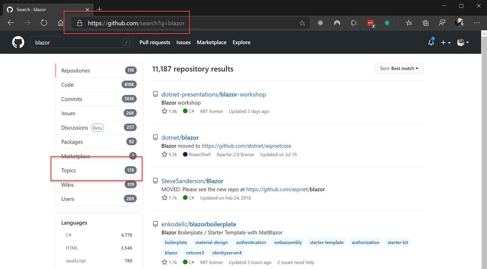
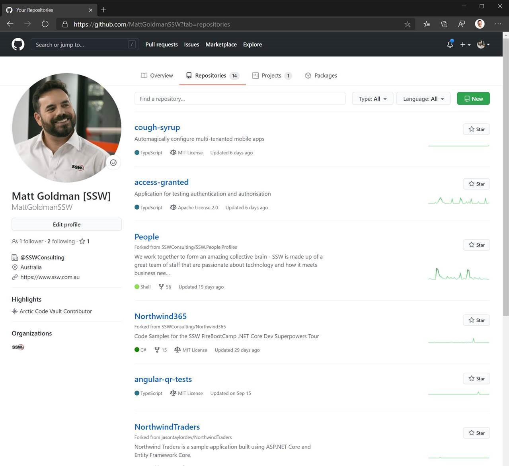
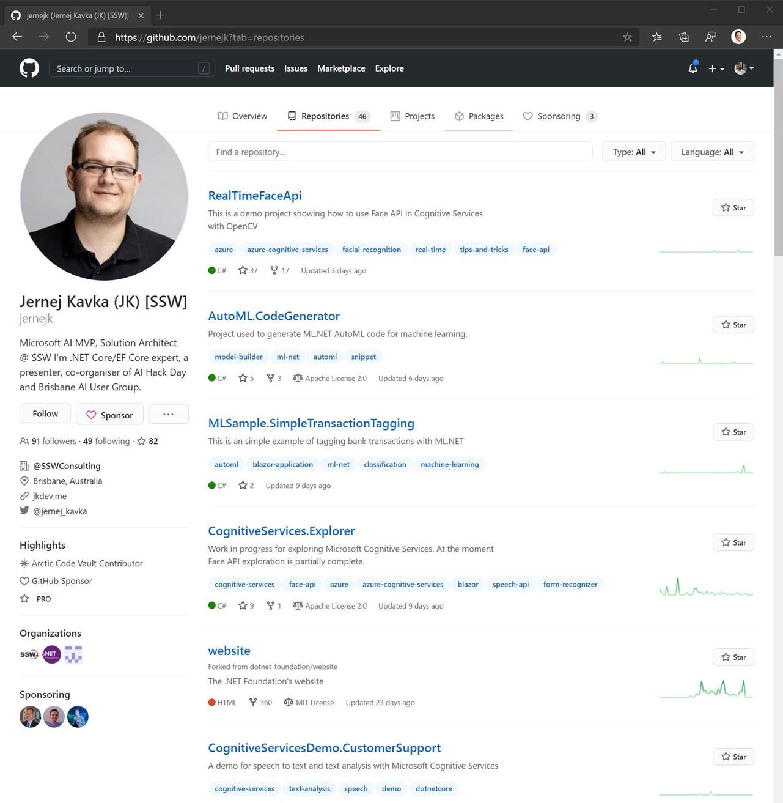

Topics are a great way to classify your repositories on GitHub.  

 <excerpt class='endintro'></excerpt> 

Topics are free text tags that help identify the technologies, purpose, and intent of your project.

Adding topics can increase the discoverability of your repos for both bots and human searchers.

 ​GitHub introduced topics in 2017, and you can use topics to search for repositories. For example, if you are looking for Blazor examples or libraries, you can enter Blazor as a search term, and then refine the search to repositories that have been tagged with the ‘Blazor’ topic.
<dl class="image"><dt></dt><dd>Figure: Searching for repositories by topic</dd></dl>
Topics also help others to find your repository and increase the visibility and discoverability of your work.
<dl class="badImage"><dt></dt><dd>Figure: Bad Example – no repositories tagged with topics on the first page</dd></dl><dl class="goodImage"><dt></dt><dd>Figure: Great example – every repository is meticulously tagged with topics</dd></dl>​ 

