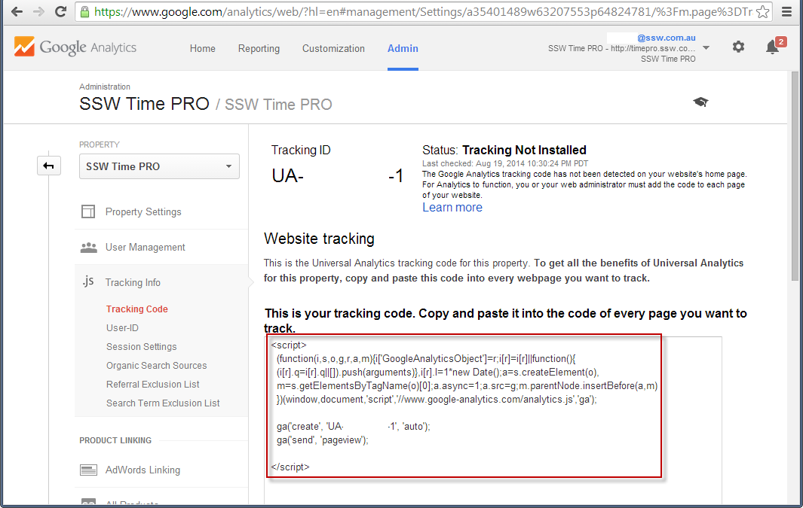

Google Analytics gives you a great insight into how, when and where your website is used. If you're not using an analytics package in your website, you're flying blind when it comes to understanding how, when and where your website is used.

<!--endintro-->

`youtube: https://youtu.be/I3GneD2bPJg`
**Video: How To Setup Google Analytics In 2025 - Complete Tutorial (9 min)**

By using Google Analytics, you will be able to see what your visitors are viewing and what they aren't, what they spend large amount's of time on, what pages are causing errors, what pages are directing visitors to you, which browsers and devices are being used to see your site and more. All this information help you better structure your site to what your visitors like. It also allows you to compare site traffic from one month to another.

The most useful reports:

* Number of users
* Which are the most popular pages of your website
* Time spent on the website
* Geographical origin of users
* Which sites are referring the most hits to you (e.g. search engines)
* Which keywords are bringing users to your site
* If you have downloads, which are the most popular

## Adding Google Analytics to **websites**

To add Google Analytics to your website:

1. [Log into your Google account](https://www.google.com/analytics)
2. Go to **Admin** 
3. Create a new **Account** (if needed) and a new **Property**
4. Specify your website details
5. Find your **Tracking Code**
6. Add the script to your website

From this page, you will be able to get a JavaScript snippet to include in your application.

Once deployed, this script will start tracking metrics and interacting with Google Analytics. You are good to go!

More information on [Set up Analytics for a website and/or app](https://support.google.com/analytics/answer/9304153).

### Adding Google Analytics to **blogs**

Using the above instructions, you can add Google Analytics to any website, including any blog. However, you may also find that your blogging platform or theme provides a way to set up Google Analytics **using a plugin** or other simple approach. Check your theme's documentation - sometimes it's as simple as adding the tracking code to configuration. Of course, adding the above JavaScript is easy enough in any case.

---

## Plausible - For when Google Analytics is too much

Google Analytics is incredibly powerful, but for many marketing sites, blogs, and small products it can feel like using a 747 cockpit to check your speed.

Some common issues:

* Steep learning curve and cluttered UI for simple questions
* Heavy script that can slow down page loads
* Reliance on cookies and personal data, which means consent banners, adblockers, and missing data
* Tight alignment with Google’s ad ecosystem, which some teams simply don’t want or need

If you just want fast, trustworthy, privacy-friendly insight, it’s worth looking at **[Plausible Analytics](https://plausible.io/docs "Welcome | Plausible docs")**.

### How Plausible helps

**1. Clarity over complexity** - Plausible focuses on the essentials (pageviews, top pages, referrals, conversions, campaigns) in a single, clean dashboard. No maze of reports, no custom exploration degree required

**2. Privacy-first, usually no cookie banner** - Plausible is cookieless and doesn’t collect personally identifiable data or use cross-site tracking. It’s designed to be GDPR/CCPA/PECR friendly out of the box, which often means you can run meaningful analytics without an intrusive consent pop-up

**3. More reliable numbers in a blocker-heavy world** - Because it’s lightweight, privacy-focused and can be proxied through your own domain, Plausible is less likely to be blocked than traditional tracking scripts. In practice, that can mean *more* accurate counts of real visitors than a heavily blocked GA4 setup

**4. Faster site, happier users** - The Plausible script is tiny compared to GA, helping you keep your Core Web Vitals and page experience in good shape. Analytics shouldn’t cost you conversions

**5. Open, independent, and self-hostable** - Plausible is open source, run by an independent team, with the option to self-host and keep full control over your data if that matters to your organization

If you rely heavily on GA4’s advanced features (ad platform integrations, complex attribution, BigQuery exports), keep it. Otherwise, **consider running Plausible alongside GA for a while.** It’s a one-line script, easy to test, and for many sites it delivers the important 10% of metrics without the 90% of noise.
