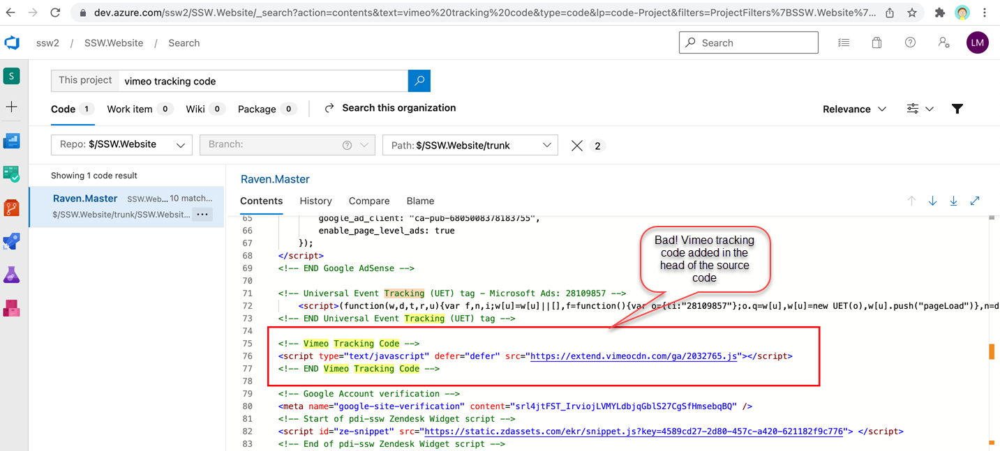
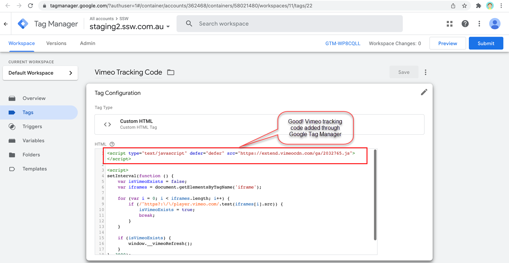

Many website integrations will require a HTML tag in added to your website. This can be painful to manage when dealing with the code. To add those tags, we recommend using **Google Tag Manager**.

::: info
Google Tag Manager is a tag management system (TMS) that allows you to quickly and easily update measurement codes and related code fragments collectively known as tags on your website or mobile app.
:::

<!--endintro-->

::: bad

:::

::: good

:::

Learn more on [Google Tag Manager official site](https://marketingplatform.google.com/about/tag-manager/benefits/).