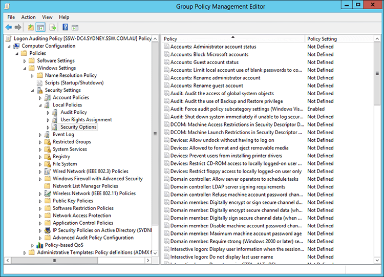
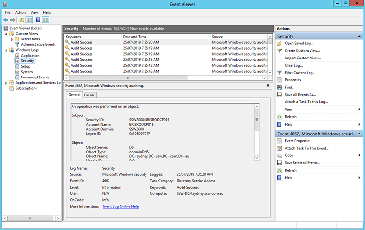

It is important as a Network Administrator to know when and where failed log in attempts are coming from. Through Group Policy you can enable "Audit log on events".

<!--endintro-->

1. Create a group policy called 'Logon Auditing Policy'
2. Right click on 'Logon Auditing Policy' and click on Edit to bring up Group Policy Management Editor
3. Select 'Audit account log on events' from Computer Configuration | Policies | Windows Settings | Local Policies | Audit Policy and set to Success, Failure
4. Select 'Audit log on events' from Computer Configuration | Policies | Windows Settings | Local Policies | Audit Policy and set to Success, Failure

  

5. Select 'Audit: Force audit policy...' from Computer Configuration | Policies | Windows Settings | Local Policies | Security Options and set to Enabled

  

  
Now when you will have access to seeing success/failed log in attempts on user accounts, these can then be captured and audited with your own internal process or a third party application such as Whats Up Gold, see: [Do you monitor failed log in attempts?](/monitor-failed-login-attempts)
