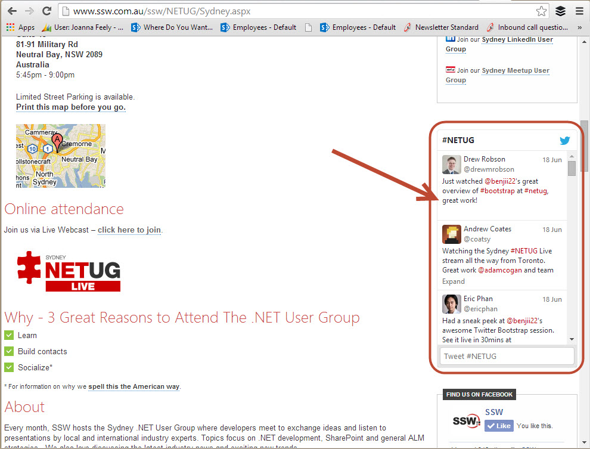

Hashtags identify the keyword or topic of interest that the post is about. They allow searching for similar posts on the topic. They were popularized on Twitter and now work on Facebook, Pinterest, etc. On Twitter, it is possible to "track" (aka Subscribe to) a tag.  

<!--endintro-->

The best tweets will use a combination of @mentions and #hashtags where appropriate to properly leverage the platform – that way readers can check out the people involved OR join the conversation about a topic. See our rule on [when to use a hashtag vs. a @mention](/do-you-know-when-to-use-a-hashtag-vs-a-mention) to see how to best leverage them in combination.

### Tips for companies

**Tip #1:** Encourage people to use the correct hashtag by adding the hashtag to your sidebar or footer.

**Tip #2:** When creating your own hashtag to promote a service, product or event, check if it isn't already in use for anything else.

### Tips for everyone

**Tip #3:** Don't use too many hashtags – 4 is a good number if you have relevant hashtags, or you may appear to be "spammy" and turn people off. On Instagram, you can share your hashtags on the first comment and they will appear "hidden", so you can use more here. Just remember to alternate between the hashtags you use. If you use the same hashtags on every post, they will not be as relevant.

**Tip #4:** Keep your hashtags on topic – you might seem "spammy" if you use hashtags that are unrelated to your post.

**Tip #5:** For more readability, capitalise the first letter of each word, for example, #SocialMedia.

### Examples of hashtags

* **\#SSW** - For our company-related posts
* **\#SSWRules** - For our public standards
* **\#SSWTV** - For our video channel
* **\#SSWTraining** - For our training programs
* **\#NETUG** - For our .NET User Groups
* **\#AngularHackDay** or **\#AIHackDay** - For one of our "Hack Day" training events
