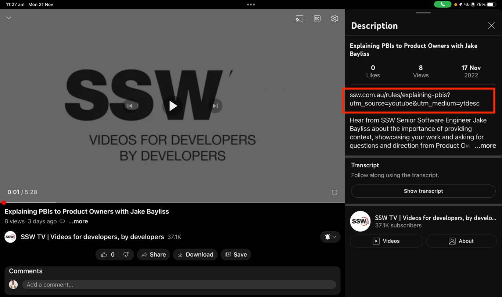

Have you ever seen the text in an email or YouTube description meant to be a link to a page and wondered why it's missing the customary blue underline or can't be clicked?

The answer is simple: the links are missing the prefix " https:// ", a prefix most modern content editors or browsers recognise as link identifiers and convert otherwise normal-looking text into easily clickable links.

Read the rule [Do you make URLs short and readable?](/create-friendly-short-urls) for a better understanding of how to create good URL's.

Adding " https:// " to the text makes the link easier to click which encourages more people to click on the link.
