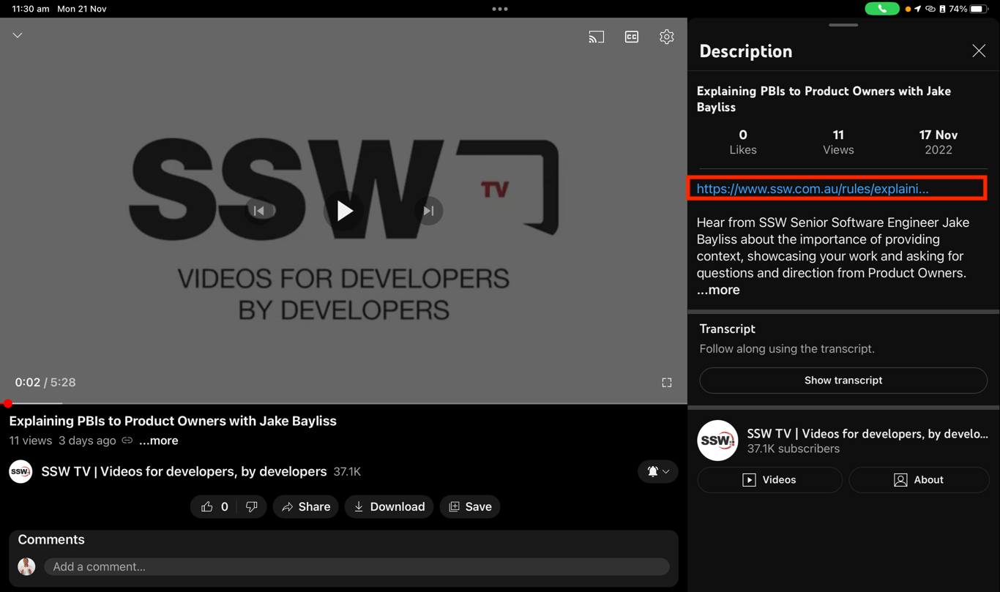

Sometimes, you may come across text in a YouTube description that appears to be a link but lacks the familiar blue color plus underline and isn't clickable. This often happens because the text is missing the "https://" prefix.

Modern content editors and web browsers usually recognize this prefix as an indicator that the text should be converted into a clickable link. Without it, the text remains plain and doesn’t function as a hyperlink.

::: bad

:::

Read the rule [Do you make URLs short and readable?](/create-friendly-short-urls) for a better understanding of how to create good URL's.

::: good

:::

Making links clickable encourages more people to click on them.
