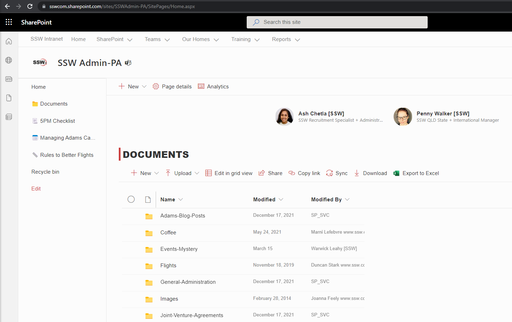
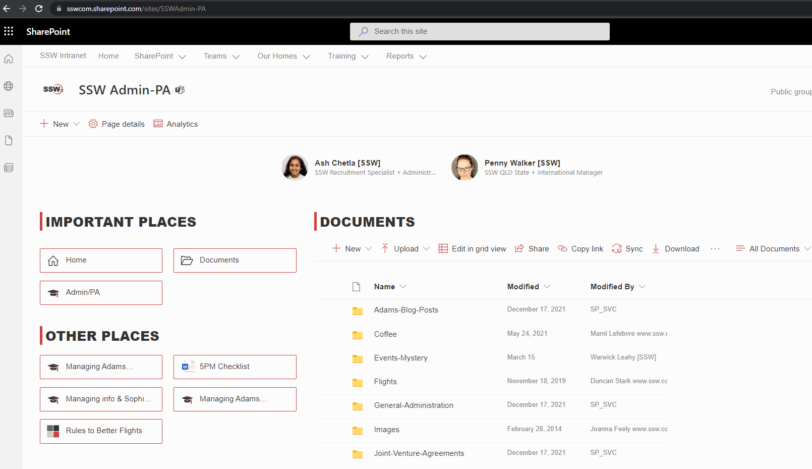

Out of the box, SharePoint provides widgets (aka webparts) to style your link with a consistent look and feel. Standard left-navigation also supports emojis 💖.

<!--endintro-->

If that's not enough and you want to customize your own links somewhere else on screen, use CSS to match the extension at the end of the &lt;a&gt; tag. Don't forget to add some padding to give it some space before the text (where the icon will be).

### Option A: Standard left navigation + emojis 🔥

If you want to style your navigation, using emojis is the simplest way to achieve consistency.

✅ UI - Consistent icons  
✅ No-code solution (configuration only)  
✅ Fast to load (no extra CSS to load)  
✅ Free $ (Out of the box)  
✅ Can be used in any size  
❌ Somewhat limited choice

### Option B: Navigation using buttons via configurable Webparts (Recommended)

Using webparts is the best way to achieve a consistent look and feel. Webparts can be customized by admin users, and require no maintenance as far as styling is concerned. SharePoint uses Office UI Fabric icons under the hood.

✅ UI - Consistent emojis  
✅ No-code solution (configuration only)  
✅ Fast to load (no extra CSS to load)  
✅ Free $ (Out of the box)  
✅ Can be used in any size  
✅ Large choice of icons
