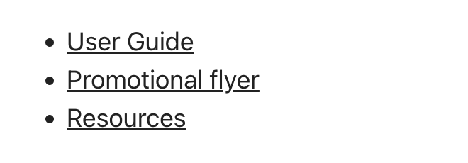
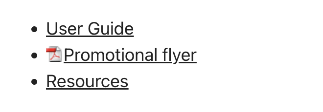

When a user clicks a hyperlink, they expect a webpage to open. If they click on a link that is actually a **.doc/.docx** file, they might encounter the unexpected experience of having Microsoft Word open in the background.

<!--endintro-->

Don't surprise users! Use icons next to links to show different types of links/files.

::: no-border
| Link/file type                                                    | Option A - Font icons (e.g. FontAwesome)                                                         | Option B - Image icons (e.g. SharePoint) |
| ----------------------------------------------------------------- | -------------------------------------------------------------------------------- | ----------------------- |
| **Regular link**                                                   | [This is a normal link](/)                                                 | ...                     |
| **[External link](/do-you-make-external-links-clear)** | [This is an external link](https://www.microsoft.com/)                                     | ...                      |
| **YouTube**                                                       | [This is a link to a YouTube video](https://www.youtube.com/watch?v=gp_F43lx6iM) | ...                     |
| **Email (mailto:)**                                               | [This link will send an email](mailto:example@mail.com)                          | ...                     |
| **PDF**                                                           | [This is a PDF file](Sample-PDF.pdf)                                             |        |
| **DOC**                                                           | [This is a Word Document file](Sample-DOC.docx)                                  |       |
| **XLS**                                                           | [This is an Excel Spreadsheet file](Sample-XLS.xlsx)                             |        |
| **PPT**                                                           | [This is a PowerPoint file](Sample-PPT.pptx)                                     |        |
| **TXT**                                                           | [This is a text file](Sample-TXT.txt)                                            |        |
| **AVI, MOV, MPG, etc.**                                           | [This is a video file](https://www.ssw.com.au/ssw/include/consulting/img/CRM_background.mp4)               |                       |
| **WAV, WMA, MP3, etc.**                                           | [This is an audio file](sample-AUDIO.mp3)                                         |     |
| **ICS or VCS**                                                    | [This is a calendar file](Sample-ICS.ics)                                        |                      |
| **ZIP**                                                           | [This is a zip file](Sample-ZIP.zip)                                             |  |
| **Google Maps**                                                           | [This is a Google Map link](https://www.google.com/maps/place/SSW+Sydney+-+Enterprise+Software+Development/@-33.8305685,151.2193249,15z/data=!4m6!3m5!1s0x6b12ae97d5dce3c1:0xae8cb5f05af0e28d!8m2!3d-33.8305685!4d151.2193249!16s%2Fg%2F1tdy4mhr?entry=ttu)                                             |  |

:::

::: bad

:::

::: good

:::

## How to add icons to links via CSS

Use CSS to match the extension at the end of the `<a>` tag. Don't forget to add some padding to give it some space before the text (where the icon will be).

### Option A: Using font icons, like FontAwesome (Recommended)

Using icon fonts saves time and hassle during the development process. It replaces the need to create/buy images, and upload them to the server.
They will also look good on any screen resolution or display.

✅ UI - Consistent icons  
✅ Fast to load (lightweight as no image)  
✅ Free $  
✅ Can be used in any size  
✅ Large choice of icons (even more than UI Fabric!)  
❌ Requires code (Inject CSS)   

To implement [use one of the different ways to set up Font Awesome](https://fontawesome.com/docs/web/#web-setup). Then find the icon unicode at [FontAwesome icons page](https://fontawesome.com/icons) and replace on the CSS "content" value.

```css
a[href$='.pdf']:before
    content: "\F08B ";
    font-family: FontAwesome;
    padding-right: 4px;
    display: inline-block;
}
```

**Figure: Replace the content string with the Unicode value from the Font Awesome site**

### Option B: Using images

Create or buy a collection of icons that match your website style. The benefit is the ability to have custom and multi-colored icons, that can look exactly like a software logo for example. But it's usually not worth the hassle. 

You will add each icon image to your server, and then add the path as background URL in the CSS file.

❌ UI - Hard to get all icons consistent  
❌ Slow (injecting images)  
❌ Paid $ (icon collection required if you want them to have a nice and consistent UI)  
❌ Maintenance of needing to upload to server  
❌ Requires code (Inject CSS)  

```css
a[href$='.pdf'] 
{ 
background: transparent url(/images/icon_pdf.gif) center left no-repeat; 
padding-left: 20 px; 
}
```

**Figure: Replace the path in background URL with each icon image**
