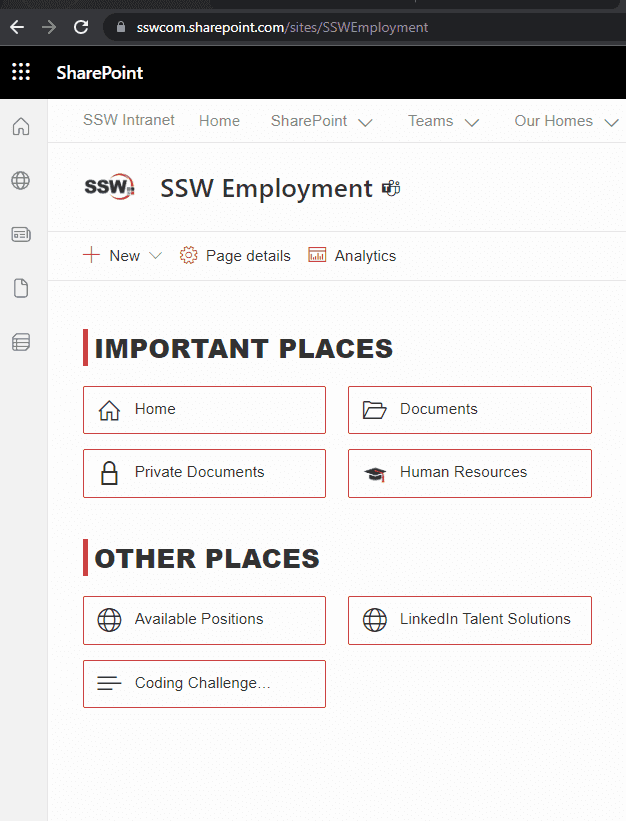
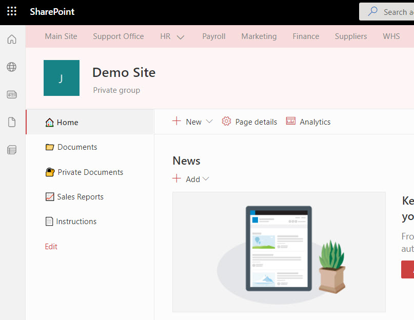

When a user clicks a hyperlink, they expect a webpage to open. If they click on a link that is actually a .Doc/.Docx file, they might encounter the unexpected experience of having Microsoft Word open in the background.

<!--endintro-->

Don't surprise users! Use icons next to links to show different types of links/files.

::: no-border
| Link/file type                                                    | FontAwesome examples                                                          | Image examples |
| ----------------------------------------------------------------- | -------------------------------------------------------------------------------- | ----------------------- |
| **PDF**                                                           | [This is a PDF file](Sample-PDF.pdf)                                             |        |
| **DOC**                                                           | [This is a Word Document file](Sample-DOC.docx)                                  |       |
| **XLS**                                                           | [This is an Excel Spreadsheet file](Sample-XLS.xlsx)                             | ...                     |
| **PPT**                                                           | [This is a PowerPoint file](Sample-PPT.pptx)                                     | ...                     |
| **TXT**                                                           | [This is a text file](Sample-TXT.txt)                                            | ...                     |
| **YouTube**                                                       | [This is a link to a YouTube video](https://www.youtube.com/watch?v=gp_F43lx6iM) | ...                     |
| **Email (mailto:)**                                               | [This link will send an email](mailto:example@mail.com)                          | ...                     |
| **Normal link**                                                   | [This is a normal link](/rules)                                                  | ...                     |
| **External link ([see rule](/do-you-make-external-links-clear))** | [This is an external link](https://www.microsoft.com/)                           | ...                     |
| **AVI, MOV, MPG, etc.**                                           | [This is a video file](sample-VIDEO.mp4)                                         | ...                     |
| **WAV, WMA, MP3, etc.**                                           | [This is a music file](sample-AUDIO.mp3)                                         | ...                     |
| **ICS or VCS**                                                    | [This is a calendar file](Sample-ICS.ics)                                        | ...                     |
| **ZIP**                                                           | [This is a zip file](Sample-ZIP.zip)                                             | ...                     |

:::

::: bad

:::

::: good

:::

## How to add icons to links

Out of the box, SharePoint provides widgets (aka webparts) to style your link with a consistent look and feel. Standard left navigation also supports emojis 💖.

If that's not enough and you want to customize your own links somewhere else on screen, use CSS to match the extension at the end of the &lt;a&gt; tag. Don't forget to add some padding to give it some space before the text (where the icon will be).

### Option 1: Use Out of the Box configurable Webparts (Recommended)

Using webparts is the best way to achieve a consistent look and feel. Webparts can be customized by admin users, and require no maintenance as far as styling is concerned. SharePoint uses Office UI Fabric icons under the hood.



✅ UI - Consistent emojis\
✅ No-code solution (configuration only)\
✅ Fast to load (no extra CSS to load)\
✅ Free $\
✅ Can be used in any size\
✅ Large choice of icons

### Option 2: Use emojis in navigation

If you want to style your navigation, using emojis is the simplest way to achieve consistency.



✅ UI - Consistent icons\
✅ No-code solution (configuration only)\
✅ Fast to load (no extra CSS to load)\
✅ Free $\
✅ Can be used in any size
❌ Somewhat limited choice

### Option 3: CSS - Using font icons, like FontAwesome

Using icon fonts saves time and hassle during the development process. It replaces the need to create/buy images, and upload them to the server.
They will also look good on any screen resolution or display.

✅ UI - Consistent icons  
✅ Fast to load (lightweight as no image)  
✅ Free $  
✅ Can be used in any size  
✅ Large choice of icons (even more than UI Fabric!)  
❌ Requires code (Inject CSS)   


To implement [use one of the different ways to set up Font Awesome](https://fontawesome.com/docs/web/#web-setup). Then find the icon unicode at [FontAwesome icons page](https://fontawesome.com/icons) and replace on the CSS "content" value.

```css
a[href$='.pdf']:before
    content: "\F08B ";
    font-family: FontAwesome;
    padding-right: 4px;
    display: inline-block;
}
```

### Option 4: CSS - Using images

Create or buy a collection of icons that match your website style. The benefit is the ability to have custom and multi-colored icons, that can look exactly like a software logo for example. But it's usually not worth the hassle. 

You will add each icon image to your server, and then add the path as background URL in the CSS file.

❌ UI - Hard to get all icons consistent  
❌ Slow (injecting images)  
❌ Paid $ (icon collection required if you want them to have a nice and consistent UI)  
❌ Maintenance of needing to upload to server  
❌ Requires code (Inject CSS)  

```css
a[href$='.pdf'] 
{ 
background: transparent url(/images/icon_pdf.gif) center left no-repeat; 
padding-left: 20 px; 
}
```
