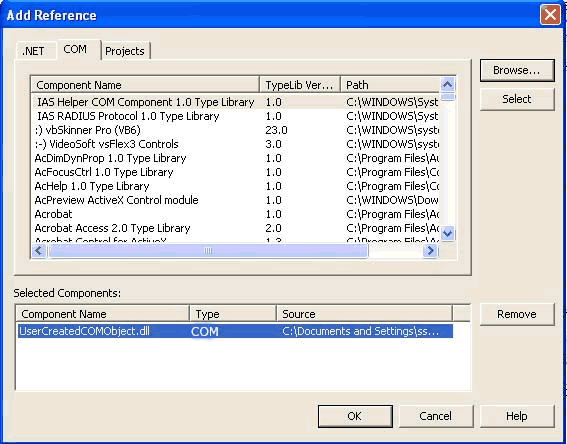

VB.NET includes the CreateObject () Method for creating the COM object. This is an old relationship between VB and COM. 
 <excerpt class='endintro'></excerpt> 

Sub CreateADODBConnection() Dim adoApp As Object adoApp = CreateObject("ADODB.Connection") End Sub 
<dd class="ssw15-rteElement-FigureBad">Figure: Bad code. Uses a VB technique - CreateObject() - for creating a COM object</dd>
Using the CreateObject() method affects the performance of your application. The variable adoApp is of type Object and this results in "late binding" 

which might lead to so much uncertainty. It is more efficient to use the interoperability features of .NET, which allows you to work with existing unmanaged code (code running outside the CLR) in COM components as well as Microsoft Win32 DLLs. The interoperability feature uses run-time callable wrappers for handling all interaction between the .NET client code (managed code) and the COM component (unmanaged code). 

To add references to COM objects: 
<ul><li>On the Project menu, select Add Reference and then click the COM tab.</li><li>Select the component you want to use from the list of COM objects.<dl class="image"><dt> </dt></dl></li><li>​To access to the interoperability assembly in your application, add an Imports statement to the top of the class or module in which you will use the COM object. </li></ul>
You can also create interoperability assemblies using the Tlbimp command line utility.  

We have a program called <a href="https://www.ssw.com.au/ssw/CodeAuditor/Rules.aspx#Interoper">SSW Code Auditor</a> to check for this rule.

