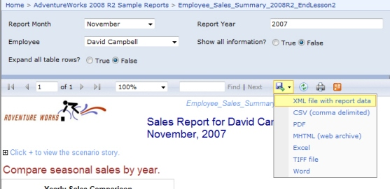
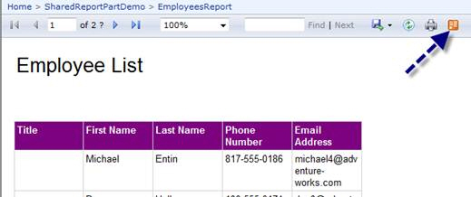

Leveraging live data feeds in Excel can transform static reports into dynamic, real-time insights, enhancing the analytical capabilities and streamlining report generation.

<!--endintro-->

::: bad  
  
:::

::: good  

:::

This is a great feature as it take advanatages of Excel 2010 PowerPivot together with Reporting Services 2008 R2 to allow end users to subscribe to live data from a report.

See what the experts said below:

> "And that, by the way, makes it very useful, as it means that PowerPivot models can get data from Essbase and SAP BW (aka Netweaver BI) (via SSRS), which standard Analysis Services cannot do. But it also means that developers can write LINQ queries against reports and that whatever OData clients sprout up can get at that data as well. In general, it means that reports in SQL R2 support a RESTful interface."
> \- Andrew Brust

> "Using atomsvc feeds and loving it :)
> We've used this feature in our last 4-5 BI projects and the clients are all applauding this feature. It is a very nice way of surfacing information to users that want to use the information as a starting point for doing more analysis. It does indeed take a lot of the burden off the IT dept that previously had to build custom reports for everything."
> \- Trond Brande
