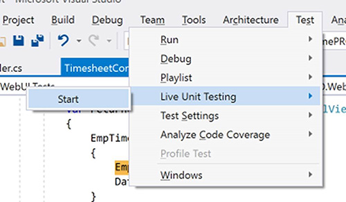
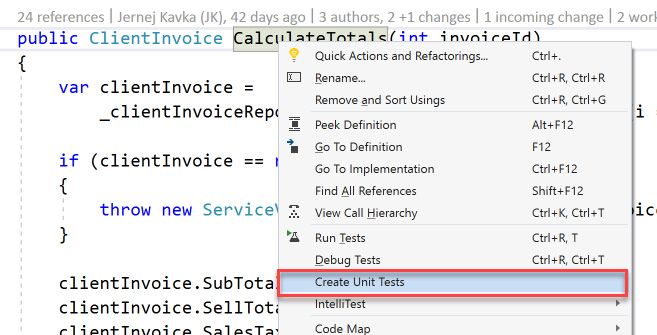
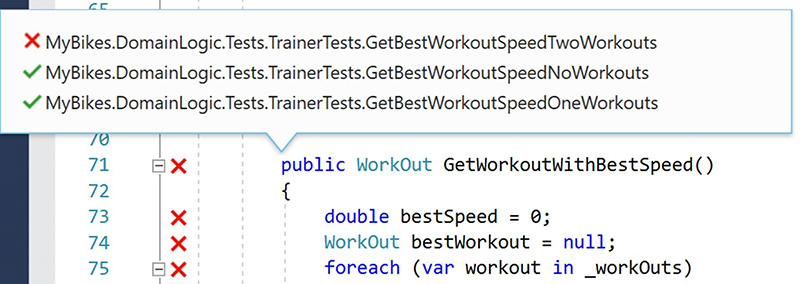

Visual Studio 2017 introduces a new feature called Live Unit Testing. This gives the developer insight into code coverage of the file that they are working on, so they can quickly and easily see if there’s a unit test that covers the code they are working on.

<!--endintro-->

  

::: bad  
  
:::

  

::: good  
  
:::

For more details see Joe Morris’s video on [.NET Tooling Improvements Overview – Live Unit Testing](https://channel9.msdn.com/Events/Connect/2016/171)
