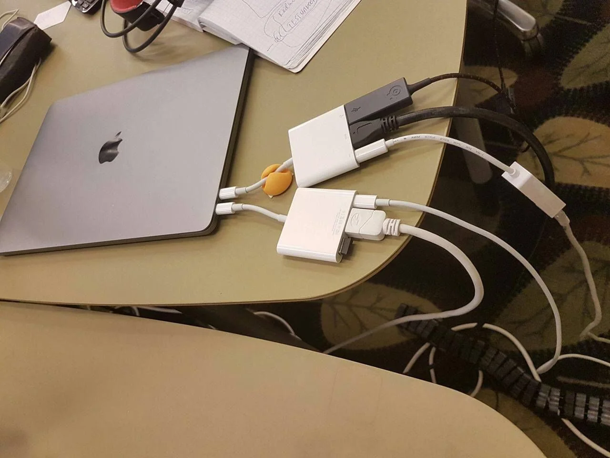
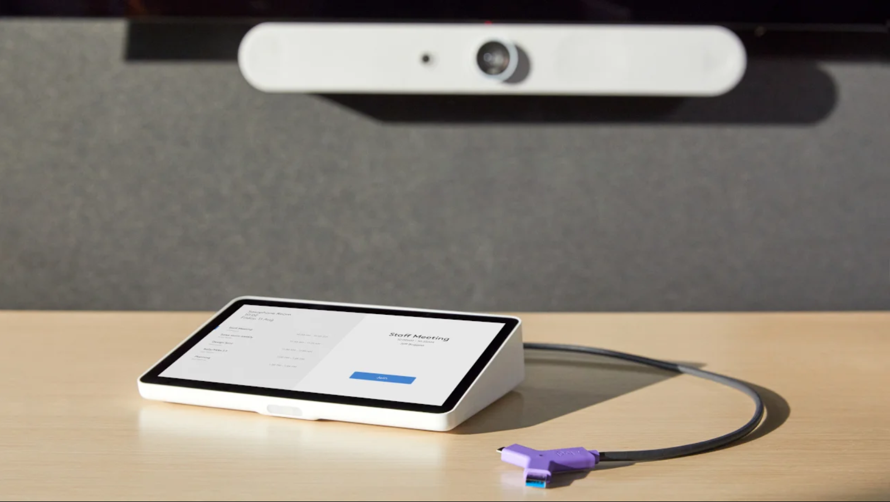
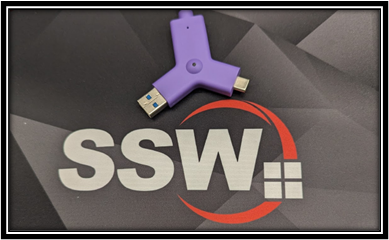

In today's fast-paced work environment, efficient communication and collaboration are paramount. However, we often encounter a common and frustrating pain point when entering a meeting room: the time-consuming and error-prone process of setting up and configuring the technology.

<!--endintro-->

`youtube: https://youtu.be/bKb-5VbU_4g`
**Video: Microsoft Teams Room - How to Use The Boardroom (6 min)**

## The Pain

1. **Wasted Time:** We've all been there - you step into a meeting room, only to find that the TV is off or the settings are incorrect. The precious minutes spent troubleshooting can disrupt the flow of your meetings and impact productivity
2. **Complexity:** Modern meeting rooms are equipped with a variety of devices and software, making it challenging to ensure everything works seamlessly. The juggling act of remote controls, apps, and cables can lead to confusion and frustration
3. **Missed Opportunities:** In today's fast-paced business world, every second counts. A delayed start or technical glitches can result in missed opportunities, whether it's a crucial client call or a collaborative brainstorming session
4. **User Discomfort:** Users may feel uncomfortable or overwhelmed by technology issues, affecting their confidence and overall experience in the meeting room

Now, imagine a solution that eliminates these pain points, making every meeting a hassle-free and productive experience. Microsoft Teams Rooms offers user-friendly options to transform your meetings into smooth and efficient interactions. You can also check out more information on Microsoft's website at [Microsoft Teams Rooms](https://www.microsoft.com/en-au/microsoft-teams/microsoft-teams-rooms).

::: bad  
  
:::

::: good  
  
:::

## The Hardware

Before you think about Microsoft Teams Rooms, you need different pieces of hardware to be able to use it. This generally consists of:

* An intelligent camera
* Good microphones
* Speakers
* A touchscreen to control your call
* A small computer to run Microsoft Teams Rooms on, or a built-in system, where all the above is connected to.

These are generally sold by Microsoft Teams Rooms partners like [Logitech](https://www.logitech.com/en-au/video-collaboration/partners/microsoft.html), Yealink, Poly, Dell, Cisco, and they are generally sold in bundles by room size:

* Huddle/Small rooms
* Medium rooms
* Large/Boardrooms

You can check out certified Teams Rooms devices at [Microsoft Teams Rooms Packages and Systems](https://www.microsoft.com/en-au/microsoft-teams/across-devices/devices/category/teams-rooms/20)

After you've acquired the gear, then it's time to see how to use your Microsoft Teams Rooms setup. In the scenarios below, let's pretend that `TeamsRoom@northwind.com` is the email address set for your Teams Rooms device.

## Option 1 - Start a call from Microsoft Teams Room

1. Check if the TV is on. If it's off, use the remote to turn it on
2. Change the HDMI output on your TV to the Microsoft Teams Rooms device, if not already
3. On the Microsoft Teams Rooms touchscreen, click "Meet" to start a call
4. Invite participants as needed
5. Utilize the touchscreen for meeting controls, such as sharing content and adjusting settings
6. End the call using the touchscreen

## Option 2 - Add the Microsoft Teams Room to your Teams call

1. Start a Teams call from another device, like your laptop or mobile phone
2. Add `TeamsRoom@northwind.com` to the call, like you would invite anyone else
3. Mute yourself on other devices to avoid audio issues
4. Continue the call

## Option 3 - CC (Carbon Copy) the  Microsoft Teams Room in your Outlook appointments

1. Include `TeamsRoom@northwind.com` in your Outlook appointments
2. Scheduled appointments will appear on the room's screen
3. On the touchscreen, join the meeting by clicking "Join" when the appointment starts

## Bonus - Share your Laptop Screen

Logitech is the recommended partner for getting your hardware from, as they have many options and easy-to-use systems. One of these options is the Logitech Swytch, a USB-C/USB-A dongle that you can use to connect any computer to, and it then shares your laptop screen directly to the TV.

1. Use the Logitech Swytch to share your laptop screen
2. Connect the Logitech Swytch to your computer via USB-A or USB-C
3. A five-second warning will appear on the screen
4. Your screen will be shared directly on the TV

::: good

:::
