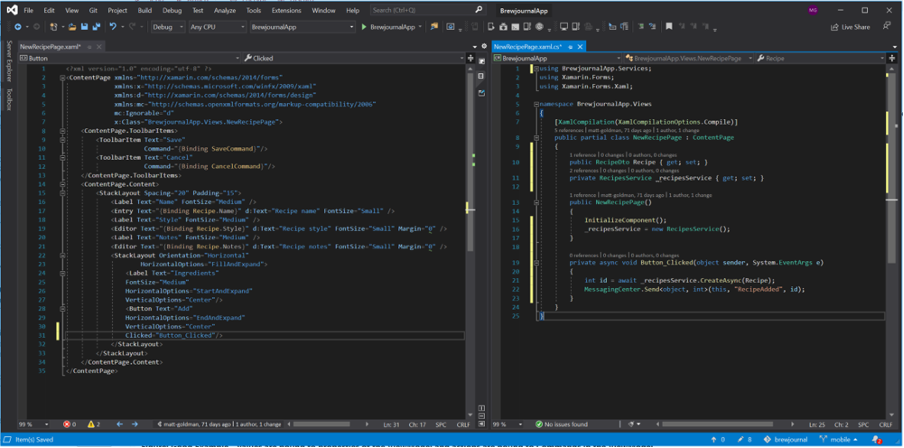
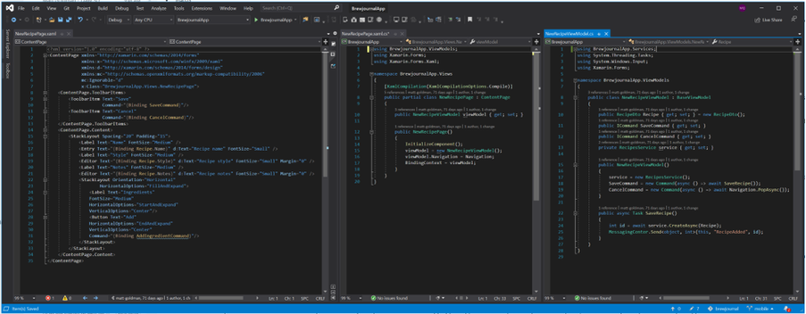

Xamarin follows the MVVM design pattern (see: [Do you use the MVVM pattern in your Silverlight and WPF Projects?](/do-you-use-the-mvvm-pattern-in-your-silverlight-and-wpf-projects). MVVM was originally developed for WPF but is the dominant paradigm in Xamarin development (at least until 2021 when Xamarin.Forms evolves into MAUI, which will make the MVU pattern a first-class citizen. See: [Introducing .NET Multi-platform App UI](https://devblogs.microsoft.com/dotnet/introducing-net-multi-platform-app-ui/).)

<!--endintro-->

MVVM allows for loose coupling between data, business logic, and UI. In Xamarin, UI is usually defined in XAML (although you can declaratively define your UI in C# code too). Your UI is called a 'view' - a view can be a page or a UI element, although UI elements that are not complete pages are more often referred to as     *controls*.

::: bad  
  
:::

::: good  
  
:::

Xamarin supports MVVM out of the box, but there are several MVVM frameworks available that enhance this functionality. For example, some MVVM frameworks support "convention over configuration", allowing you to just code your View and ViewModel and let the framework hook them up for you. Some include:

* **[Prism](https://github.com/PrismLibrary/Prism):** Prism is an MVVM framework that was developed initially for WPF but has since been ported to Xamarin Forms. It is stable and mature. 
* **[FreshMVVM](https://github.com/rid00z/FreshMvvm):** FreshMVVM is a framework that was built from the ground up specifically for Xamarin Forms. It is open-source and maintained by a Microsoft and Xamarin MVP. 
* **[MVVMLight](https://github.com/lbugnion/mvvmlight):** This is another framework built especially for Xamarin, although it is not currently under active maintenance. 
