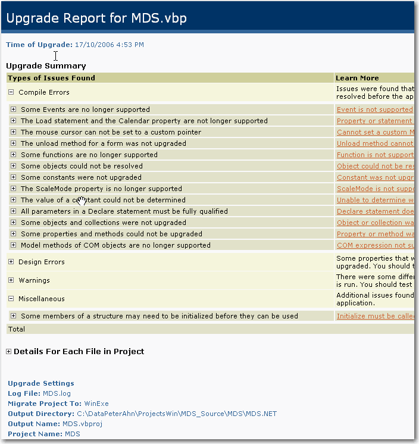

The Visual Basic Upgrade Wizard is a great place to start converting to VS.NET 2005 process. The upgrade happens automatically when you open a Visual Basic 6.0 project in Visual Basic 2005: the Upgrade Wizard steps you through the upgrade process and creates a new Visual Basic 2005 project.   

<!--endintro-->

Nonetheless, there are still some major changes from Visual Basic 6 to Visual Basic 2005, which will require you to rewrite. Data access is probably the largest one, and graphics and printing make a large dent in the total as well. Even with these major changes, though, the Wizard is clearly the place to start. 

