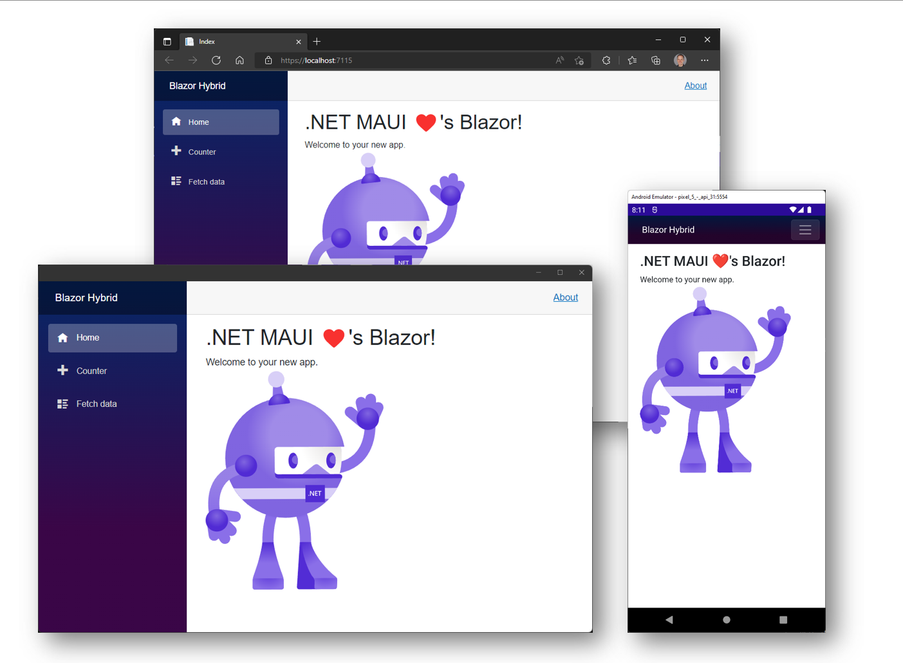
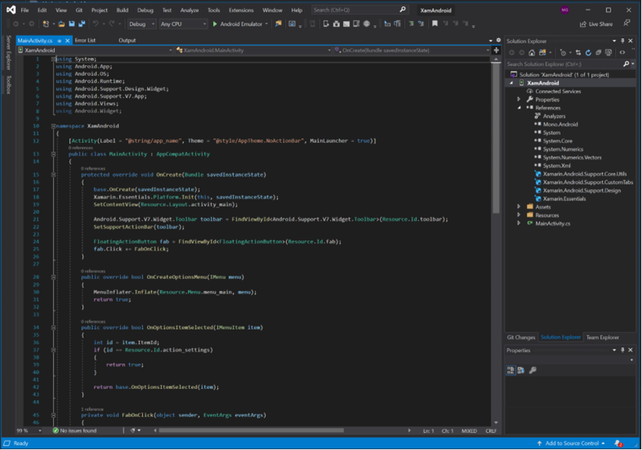
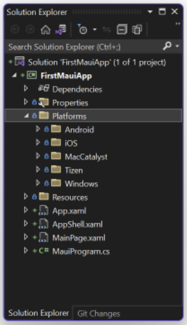
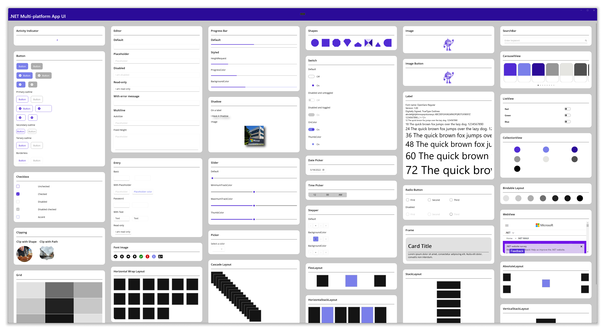

Xamarin has evolved beyond simply being an abstraction of the platform native APIs for iOS, Android, and UWP. It is now the .NET Multi-platform App UI (.NET MAUI).

Where previously you could write shared business logic in C# but needed to write your UI in either Xamarin.Android or Xamarin.iOS, now you can write cross-platform UI code in a single .NET MAUI project.

<!--endintro-->

Theoretically, it is possible to write your code only once and share 100% of the code you write across all target platforms - see [Adam Cogan's blog post](https://adamcogan.com/2015/01/14/getting-96-code-reuse-with-xamarin-forms/) for a case study of achieving 96% code reuse.

::: bad

:::

It is possible to implement beautiful and complex UI designs in .NET MAUI, especially given the rich ecosystem of plugins and templates available (see rule: [Do you know where to find the best Xamarin resources?](/the-best-xamarin-resources)). You can use drawing APIs like [Microsoft.Maui.Graphics](https://docs.microsoft.com/en-us/dotnet/maui/user-interface/graphics/) or the [new .NET MAUI Community Toolkit](https://docs.microsoft.com/en-us/dotnet/communitytoolkit/maui/).

::: good

:::

