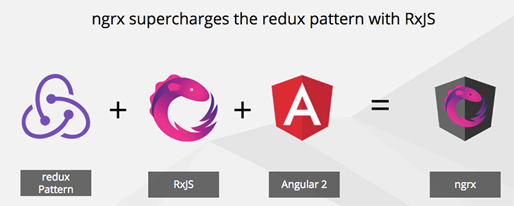
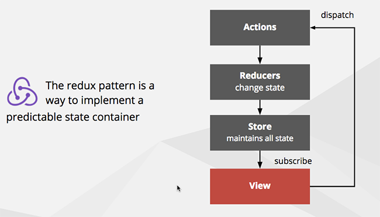

**Heads Up:** For new teams creating their first SPA using Angular, it is recommend to limit the initial focus to learning Angular, TypeScript, and RxJs. Avoid including advanced state management patterns such as NgRx, unless someone on the team has prior experience. Start with a simple approach to state management and evolve your design once the team has mastered the basics. When your team is ready, be sure to investigate the multitude of patterns, supporting libraries, and best practices available for advanced state management. If you are developing an application that absolutely requires advanced state management then be sure to invest in some training and / or enlist the help of another developer with the right skillset.

NGRX is a powerful state management library for Angular applications. By implementing the Redux pattern, it provides a predictable and centralized approach to managing application state. 

On large applications, it becomes very difficult to maintain state. The redux pattern helps resolve this issue.


NgRx is the redux pattern implemented for Angular.        [View on GitHub](https://github.com/ngrx).


<!--endintro-->

  

Benefits:

* Easy state management
* Better tooling and debugging
* Simpler applications to build
* Increased performance
* Code that is easy to test


  

  

The three principles of the redux pattern:

1. The entire state of the application is represented in a single JavaScript object called a store.
2. The store is acted upon using special functions called reducers.
3. State is immutable and reducers are the only part of the application that can change state.


### What do we mean by complex?


State management such as ngrx is most useful when applied to shared data  - that can be changed or "mutated" in multiple ways. When applied to data that is not shared there is a risk of adding much more effort with little value

**Simple Example**

"Add a company edit form to capture a company's address and contact details, when the user clicks 'save', we send a HTTP POST to an API". 

In this type of scenario, the company details you are editing are not shared with any other component so you get little benefit from using state management.

**Complex example**

"Add a checkout screen where users can change order quantities and see the totals immedately update. Also there is a widget in the toolbar that shows number of items and cart total at all times"

### Getting Started with NGRX in Angular Applications

**Step 1: Define Actions:**

Actions are defined to be dispatched in your application.

Actions represent events or intents that trigger state changes.

Each action is typically defined as a constant using the `createAction` function

Actions may also include payload data using the props function.

For example:

``` typescript
import { createAction, props } from '@ngrx/store';

export const loadProducts = createAction('[Product] Load Products');
export const productsLoaded = createAction('[Product] Products Loaded', props<{ products: Product[] }>());

// Add more actions as needed
```
**Step 2: Create Reducers:**

Reducers handle state changes based on dispatched actions.

Reducers are pure functions that take the current state and an action as input and return a new state.

Define the initial state for each state slice and handle state changes in response to specific actions.

Use the `createReducer` function from @ngrx/store to create reducer functions.

For example:

``` typescript
import { createReducer, on } from '@ngrx/store';
import { productsLoaded } from '../actions/product.actions';

export interface ProductState {
  products: Product[];
}

export const initialState: ProductState = {
  products: [],
};

export const productReducer = createReducer(
  initialState,
  on(productsLoaded, (state, { products }) => ({ ...state, products })),
  // Add more reducer functions as needed
);
```

**Step 3: Configure the Store:**

Import the necessary NGRX modules, such as StoreModule and StoreDevtoolsModule, into your root module (e.g., app.module.ts).

Provide the root reducer using the reducer property of the StoreModule.forRoot() method.

Optionally, include StoreDevtoolsModule.instrument() to enable the Redux DevTools extension.

For example:

``` typescript
import { StoreModule } from '@ngrx/store';
import { StoreDevtoolsModule } from '@ngrx/store-devtools';
import { rootReducer } from './store/reducers';

@NgModule({
  imports: [
    StoreModule.forRoot(rootReducer),
    StoreDevtoolsModule.instrument(),
    // Other imports and configurations
  ],
  // Other module configurations
})
export class AppModule { }
```

**Step 4: Dispatch Actions and Access State from the UI:**

Import the necessary action creators and selectors into your Angular components or services.

Inject the Store into your components or services.

Dispatch actions using the dispatch() method of the Store to trigger state changes.
Access the state using selectors and the select() method of the Store.

For example:

``` typescript
import { loadProducts } from './store/actions/product.actions';
import { selectProducts } from './store/selectors/product.selectors';

constructor(private store: Store<AppState>) {}

// Dispatching an action
this.store.dispatch(loadProducts());

// Accessing a State
this.store.select(selectProducts).subscribe((products) => {
  // Access and use the products state
});
```

**Define Effects (Optional):**

You can also handle side effects in NGRX by defining Effects, such as asynchronous operations or APIs interactions.

  

Effects listen for specific actions and perform operations in response, such as making HTTP requests.

Effects are created as classes with the @Injectable() decorator and typically use 
the createEffect function from @ngrx/effects.

Register the effects using the EffectsModule.forRoot() method in the root module.

For example:

``` typescript
loadProducts$ = createEffect(() =>
  this.actions$.pipe(
    ofType(loadProducts),
    mergeMap(() =>
      this.productService.getProducts().pipe(
        map((products) => productsLoaded({ products })),
        catchError((error) => of(productsLoadError({ error })))
      )
    )
  )
);
```

**Check out [NGRX Documentations](https://ngrx.io/docs) to see more details on how you can set up NGRX in your Angular application**

This type of complexity is perfect for ngrx! The state of your shopping cart can be in kept the Store an both the main Checkout Component and the Cart widget can be kept in sync by selecting this state from the store and raising actions to mutate that state in controlled and predictable ways.
