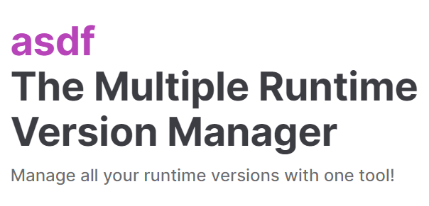

Managing software versions can be a complex and time-consuming task, especially when you're dealing with multiple applications across various platforms. In today's fast-paced digital landscape, having a unified solution that supports multiple software packages is invaluable. Imagine a single version manager that streamlines the process, ensuring that all your software remains up to date effortlessly. Let's explore the advantages and possibilities of using a version manager capable of handling multiple software applications, simplifying your workflow and enhancing your software management experience.

<!--endintro-->

Every programming language or framework build upon it has its own version managers in community, such as NVM for Node.js, RVM for Ruby, and Pyenv for Python.

However, it is not a good idea to use different version managers for different software. It is better to use one version manager supporting multiple software.

### Option A: asdf (recommended)

[asdf](https://asdf-vm.com/#/) - Manage all your runtime versions with one tool.

✅ Easy to use  
✅ Lightweight & Fast  
✅ Non-intrusive  
✅ [~700 registered plugins covering most use cases](https://github.com/asdf-vm/asdf-plugins) including *node, dotnet, dotnet-core*  

❌ Linux/Mac/WSL only

`youtube: https://www.youtube.com/embed/RTaqWRj-6Lg`  
**Video: Use asdf to manage versions of Python, NodeJS, GoLang and more! (8 min)**

### Option B: nix

[nix-shell](https://nixos.org/#asciinema-demo-cover) - A tool that allows you to create and manage isolated, reproducible development environments for software projects, using the Nix package manager and a declarative configuration file.

`youtube: https://www.youtube.com/embed/5Dd7rQPNDT8`  
**Video: How to use Nix on Ubuntu or any Linux Distro (18 min)**

✅ Reproducibility - Same package installation process yields the same output  
✅ Declarative configuration - Nix uses a declarative configuration format to describe packages and their dependencies  
✅ Extensibility - Developers can extend its functionality through plugins and custom builders  

❌ Steep learning curve  
❌ Intrusive  
❌ Linux/Mac/WSL only  

