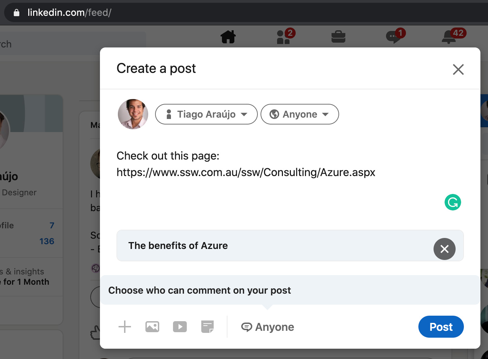
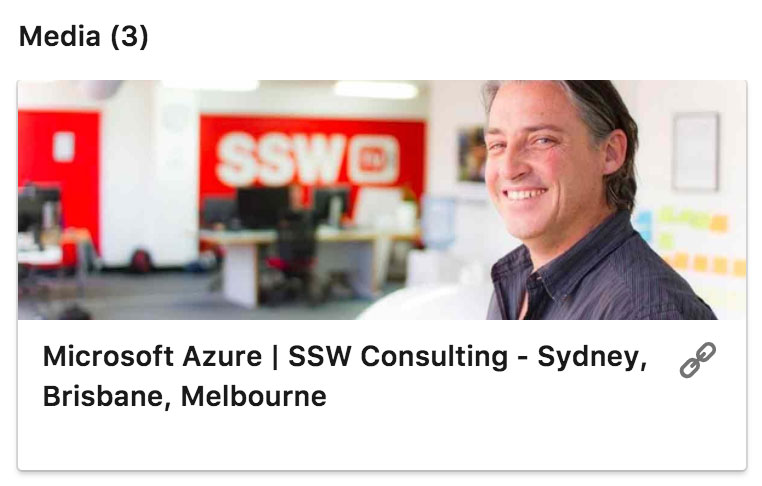

Open Graph is a metadata tag that allows you to control what content shows up when a page is shared on social media networks.

<!--endintro-->

It should be placed on the &lt;head&gt; section of your page. The most used properties are:

```xml
<meta property="og:title" content="Your Custom Title" />
<meta property="og:description" content="Your custom description of the page." />
<meta property="og:image" content="https://www.YourCustomImage.jpg"/>
```

::: bad  
  
:::

::: good  
  
:::

::: info
**Note:** For LinkedIn you might need to add the prefix as following:

```xml
<metaprefix="og: http://ogp.me/ns#" property='og:title' content="Microsoft Azure | SSW Consulting - Sydney, Brisbane, Melbourne"/>
```

:::

More information and other properties can be found at [The Open Graph protocol](https://ogp.me/).
