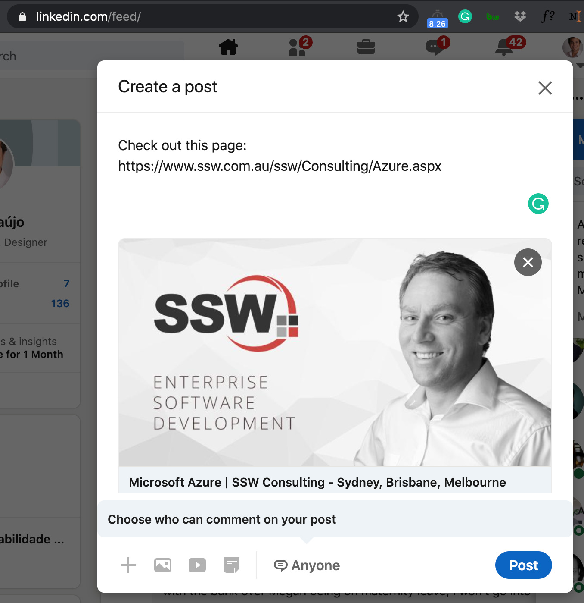

Open Graph is a metadata tag that allows you to control what content shows up when a page is shared on social media networks. 
 <excerpt class='endintro'></excerpt> 

It should be placed on the &lt;head&gt; section of your page. The most used properties are:

&lt;meta property="og:title" content="Your Custom Title" /&gt; &lt;meta property="og:description" content="Your custom description of the page." /&gt; &lt;meta property="og:image" content="https://www.YourCustomImage.jpg"/&gt;  
<dl class="badImage"><dt>  </dt><dd>Figure: Bad example - Shared link has no image and the title was "guessed" by LinkedIn</dd></dl><dl class="goodImage"><dt>  </dt><dd>Figure: Good example - Shared link has a nice image and title, both defined via​ Open Graph tags  </dd></dl>
 
   <b>Note: </b>For LinkedIn you might need to add the prefix as following:

 &lt;meta prefix="og: http://ogp.me/ns#" property='og:title' content="Microsoft Azure | SSW Consulting - Sydney, Brisbane, Melbourne"/&gt;  

More information and other properties can be found at <a href="http://ogp.me/" target="_blank">http://ogp.me </a> 

