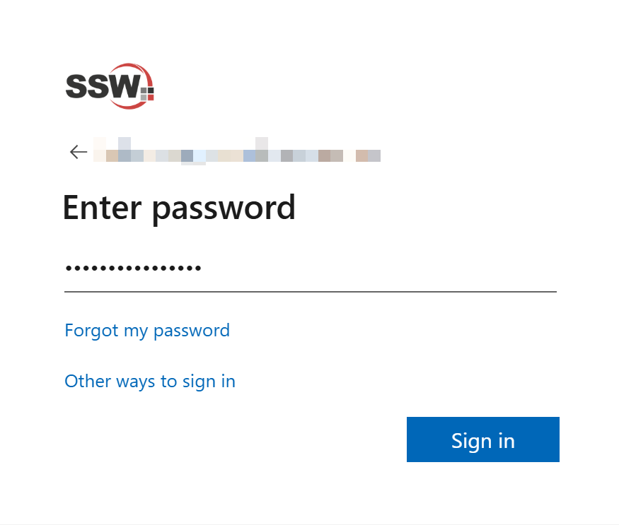
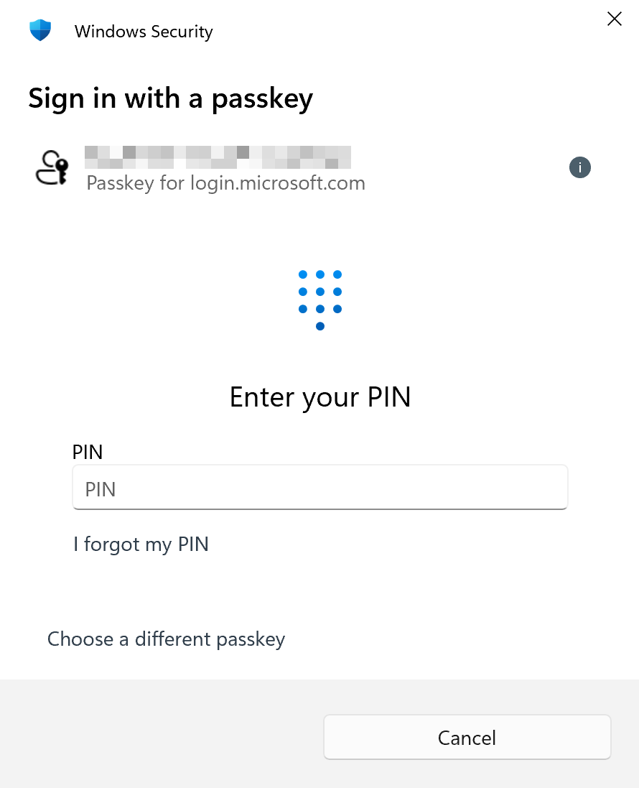
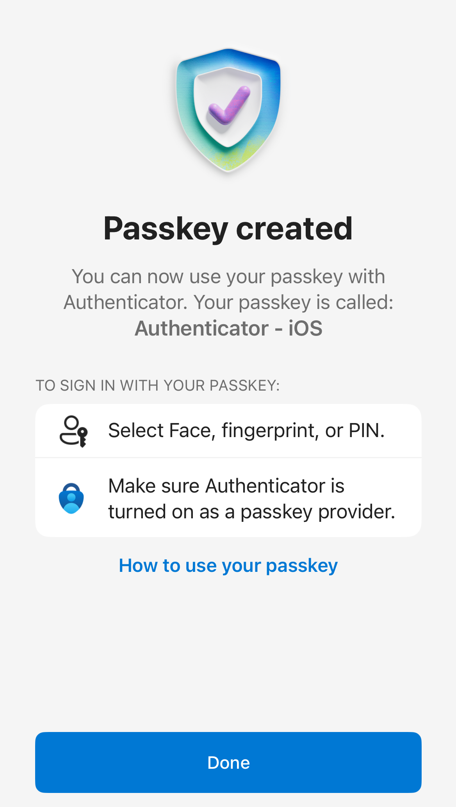

Passwords are a traditional technology that creates security vulnerabilities through reuse, breaches, and phishing attacks. Passwords remain a weak point in your security chain. Passkeys represent the next evolution in authentication, providing phishing-resistant, seamless integration with biometric technology, and passwordless security that's both more secure and more convenient than traditional methods.

<!--endintro-->

`youtube: https://www.youtube.com/embed/bdp8RdjV6PU`
**Video: What are passkeys? Explained in under 4 minutes**

## Why Passkeys are superior to passwords

### Security benefits

1. **Phishing-resistant** - Unlike passwords and SMS codes, passkeys cannot be stolen through phishing attacks because they use cryptographic keys tied to specific domains
2. **No password reuse** - Each passkey is unique to a service, eliminating the risk of credential stuffing attacks across multiple sites
3. **Breach-proof** - Services only store your public key, so even if breached, attackers get nothing useful
4. **No interceptable codes** - Unlike SMS-based MFA, passkeys can't be intercepted or redirected

### User experience benefits

1. **Faster sign-in** - Authenticate with just your biometric (fingerprint, face, or PIN) - no typing passwords or waiting for SMS codes
2. **Cross-platform sync** - Passkeys sync across your devices through your platform's secure sync (e.g. Microsoft Authenticator)
3. **No forgotten passwords** - Never forget a password again or get locked out of accounts

::: bad

:::

::: good

:::

## How to set up Passkeys for your Microsoft account

### Prerequisites

* Microsoft Authenticator app installed on your mobile device and your Microsoft account added to Authenticator
* A device that supports biometric authentication (fingerprint, face recognition, or PIN)

### Steps to create a Passkey

1. **Navigate to your Microsoft security settings**

   * Go to [https://mysignins.microsoft.com/security-info](https://mysignins.microsoft.com/security-info)
   * Sign in with your Microsoft account credentials

2. **Add a new sign-in method**

   * Click **"+ Add sign-in method"**

3. **Choose your passkey type**

   * Select **"Passkey in Microsoft Authenticator"** for device-bound passkeys using face, fingerprint, or PIN

4. **Set up through Microsoft Authenticator**

   * In Authenticator app select your Microsoft account
   * Then select **Create a passkey** and follow the instructions

   

5. **Test your passkey**

   * Sign out of your Microsoft account
   * When signing back in, select **"Other ways to sign in"**
   * Choose **"Face, fingerprint, PIN, or security key"** option
   * Use your biometric authentication to complete sign-in

::: greybox
**Pro tip:** Set up passkeys on multiple devices (phone, laptop, tablet) to ensure you always have access to your accounts even if one device is unavailable.
:::

### Managing your passkeys

* **View all passkeys:** Return to [https://mysignins.microsoft.com/security-info](https://mysignins.microsoft.com/security-info) to see all registered passkeys
* **Remove passkeys:** Delete unused passkeys for old or lost devices

## Supporting Passkeys in your applications

If you're developing applications, consider implementing passkey support using:

* **WebAuthn API** for web applications
* **Platform-specific APIs** for mobile apps
* **FIDO2 libraries** for server-side implementation

Learn more at [FIDO Alliance](https://fidoalliance.org/passkeys/) and [Microsoft's Passwordless documentation](https://learn.microsoft.com/en-us/entra/identity/authentication/concept-authentication-passwordless).

## The future is passwordless

Most companies including SSW have committed to the vision of a passwordless future. By adopting passkeys now, you're not just improving your current security posture - you're preparing for a world where passwords become obsolete.
