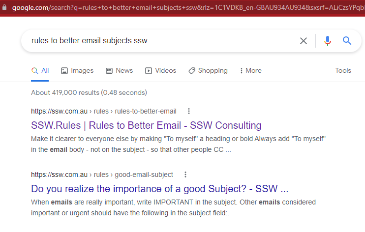
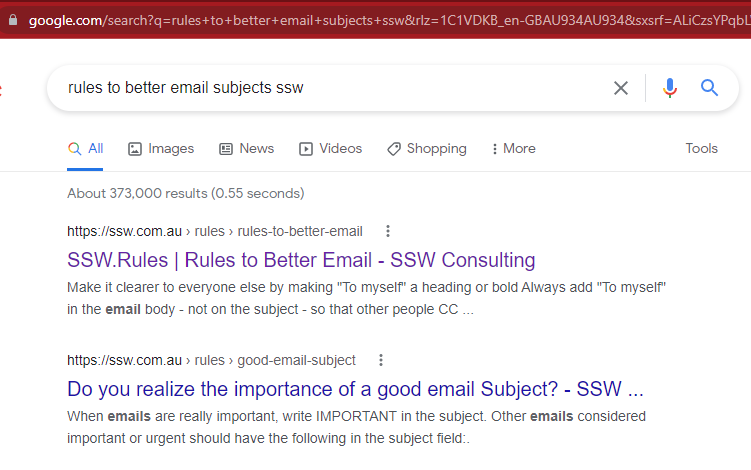
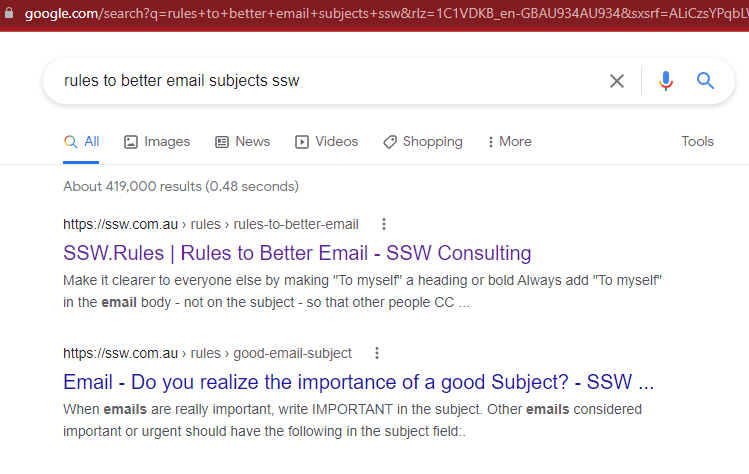

English can be really confusing sometimes, and it is often difficult to decipher someone's meaning without proper context. This problem is particularly notable when you are browsing a page on google, because you lack the context of the rest of the page. 

For example, a page might have a category on a website, but when you look at it in google that category is completely missing.

At a bare minimum, the context should be completely fleshed out in the title of a page. However, the gold standard is to use prefixes.

Prefixes provide several benefits including:

<!--endintro-->

* Establishing context without having to read the content
* Priming the reader on the subject matter
* Helping the reader quickly jump to the right content in a list
* Categorizing content together without the need for a complex bespoke solution

::: bad

:::

::: ok

:::

::: good

:::