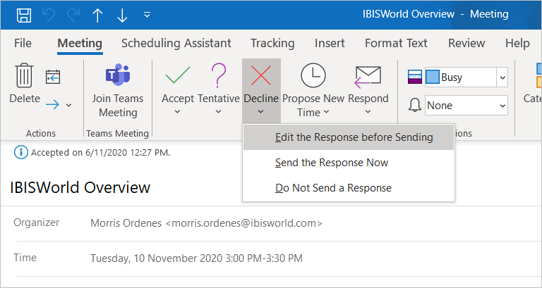
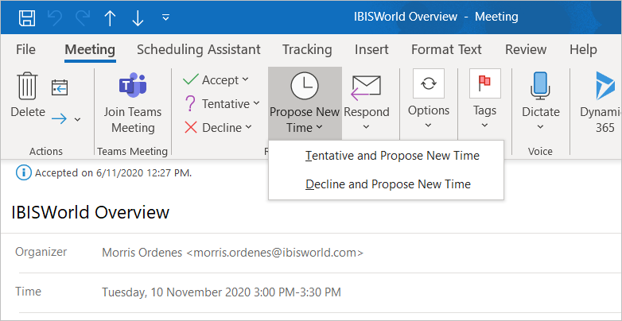
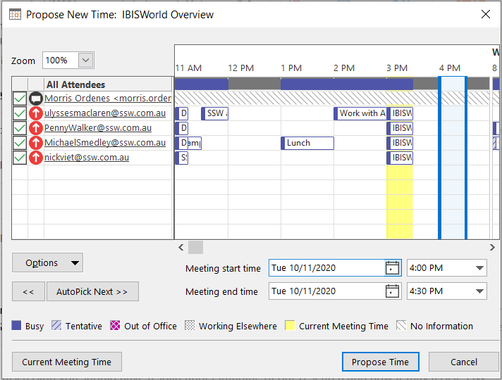

When you would like to propose a new time for an appointment that someone has sent to you, use the "Propose New Time" button in Outlook instead of simply declining the message. By using the this option, the requestor can easily accept your proposed time, rather than having to edit the previous appointment.

<!--endintro-->

::: bad  
  
:::

Instead of simply declining the message and typing your proposed time in the message body, propose a new time as follows:

::: good  
  
:::

::: good  
  
:::
