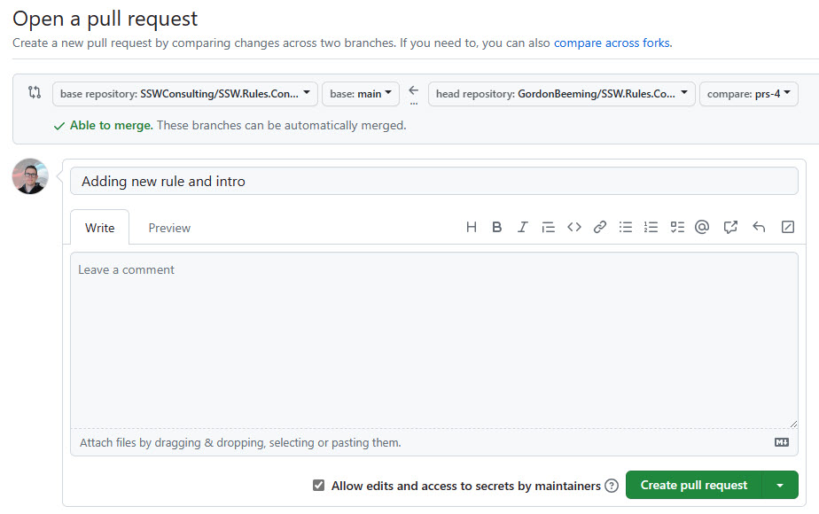
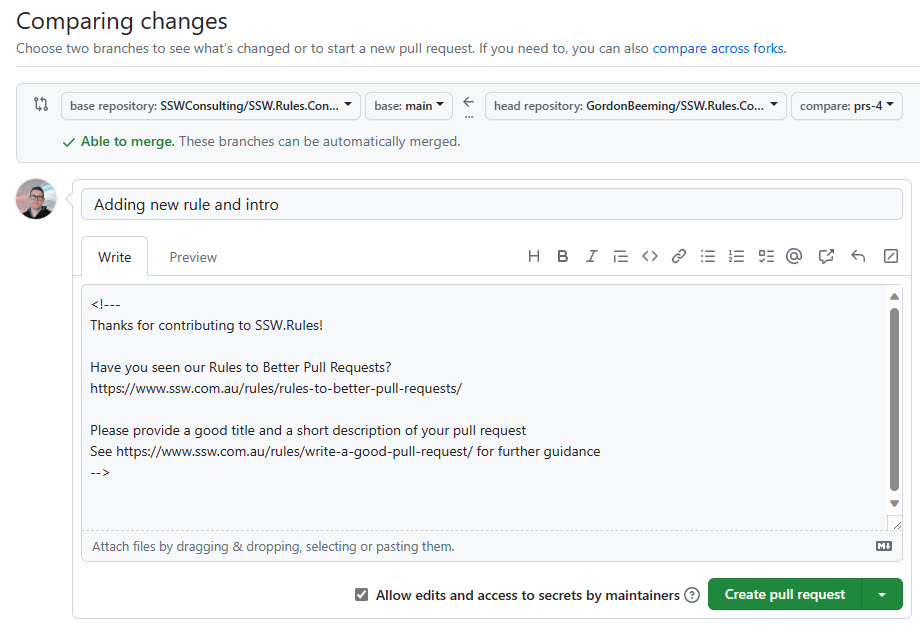
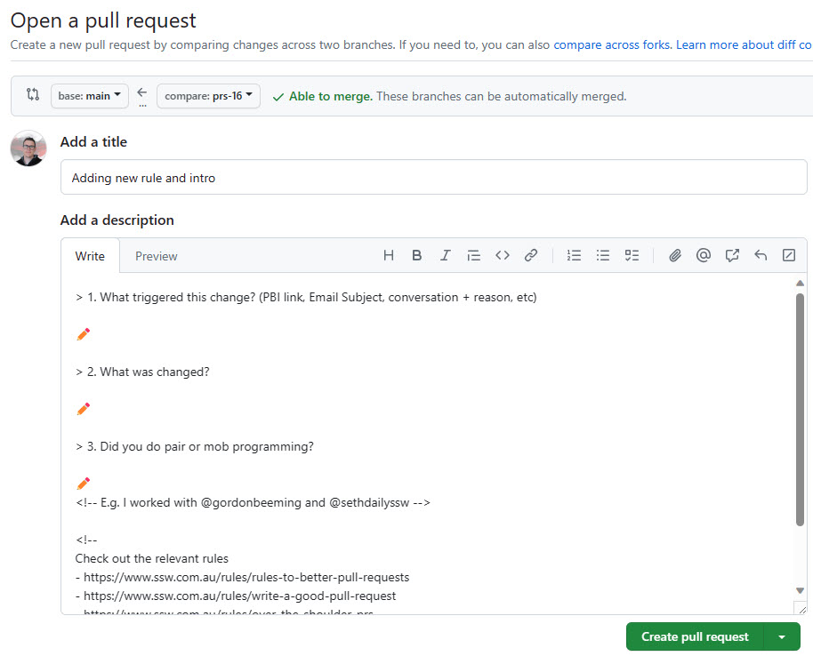

Pull Request templates are a great way to communicate expectations to developers. You should can create different PR templates for different types of PRs. For example, you can have a PR template for bug fixes, a PR template for new features, and a PR template for refactoring. You are also able to create specific PR templates for specific code paths.

You can read more about PR templates in the GitHub docs at [Creating a pull request template for your repository](https://docs.github.com/en/communities/using-templates-to-encourage-useful-issues-and-pull-requests/creating-a-pull-request-template-for-your-repository)

<!--endintro-->

When creating a PR template, think of how you can help developers create great PRs

::: bad  
  
:::

::: ok  
  
:::

::: good  
  
:::

**Tip:** You can use comments in the markdown as above. These comments will not show when the PR is created, and is only visible when editing the description.
 
For a great Pull Request template, take a look at [@SSWConsulting/SSW.GitHub.Template](https://github.com/SSWConsulting/SSW.GitHub.Template/blob/main/.github/pull_request_template.md)
