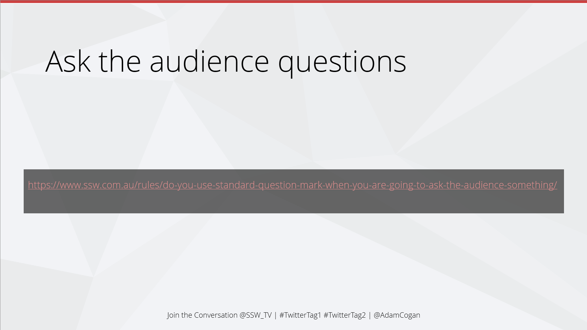

Have you ever watched an awesome presentation? The presenter promises to share some resources. You’re excited to see what they recommend. But then they start racing through their slides. The URLs flash past before you can even write them down. Frustrating, right? Don’t do that to your audience.

<!--endintro-->

`youtube: https://www.youtube.com/watch?v=gB0-1yoR8g4`

**Video: What’s the difference between QR and barcode? (2 min)**

## Use QR codes in marketing materials

You should put QR codes in all your marketing material, wherever there is a URL.
This reduces friction for interested people trying to view your website!

::: good

:::

## Use QR codes in presentations

Sometimes you need to show URLs on a slide. For example, you might be talking about the URLs themselves. But when you’re sharing resources, your audience struggles to write them down. The URLs slip past before they’re ready. And if you linger on the slide just so people can copy them, it breaks your flow.

::: bad

:::

A better approach is to use QR codes in your slides. Your audience scans the code in a second. They can bookmark the resource right away, without becoming stressed.

::: good

:::

---

::: info

**Tip:** You can use an Office add-in called QR4Office to directly generate these QR codes for slides within PowerPoint.

Check out this video:

`youtube: https://www.youtube.com/embed/XRveGL3nXUM`

**Video: How to create QR code in PowerPoint (2 min)**
:::
