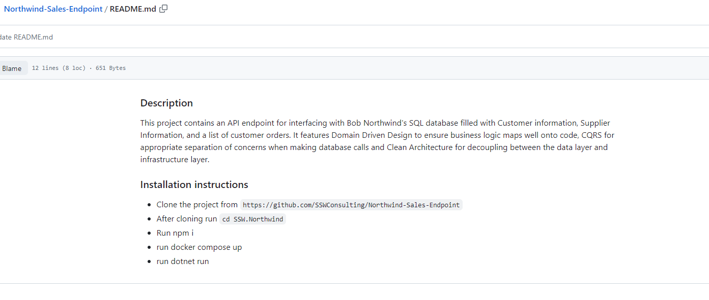
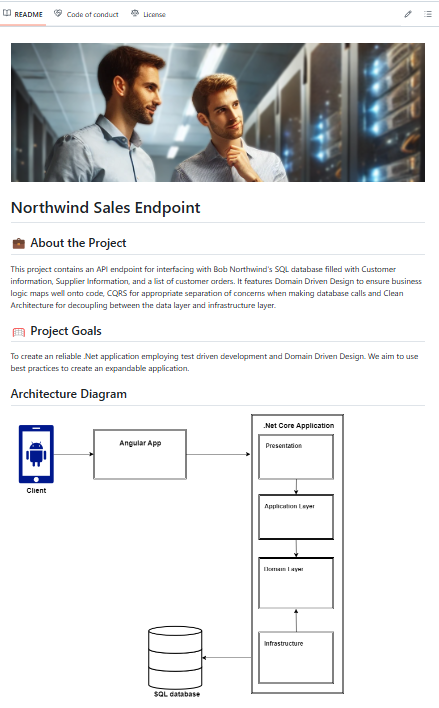
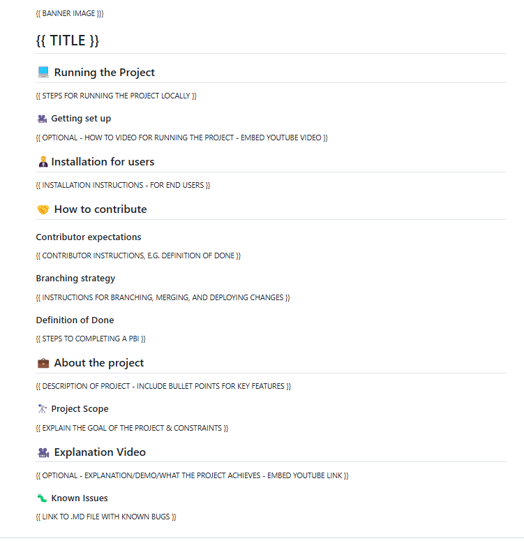
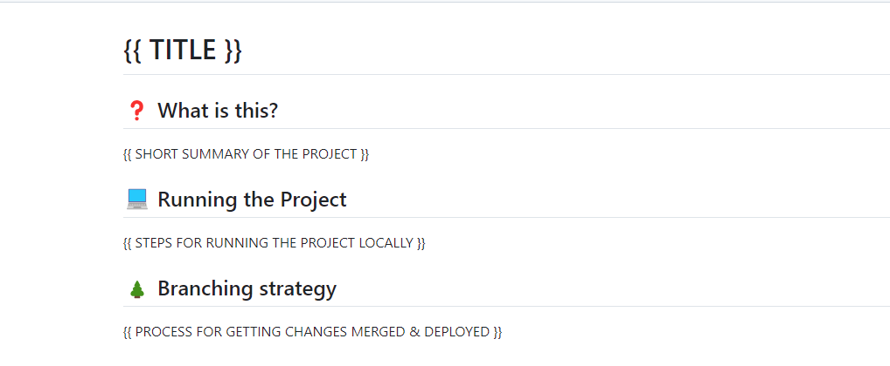

A README can often be a potential contributor's first impression of your project. It communicates the project's vision, how to contribute to the project and places where people can donate and installation instructions.

<!--endintro-->

Having a README template ensures that you’re checking all of the boxes for ensuring that contributors have an easy time getting your project up and running and beneficiaries know how to use your code.

README templates can be beneficial for ensuring your personal projects have the features necessary for gaining momentum and ensuring that projects done at an organizational level are up to a high standard.

::: bad

:::

This README is very basic, the setup instructions are limited and there is room for improvement:

* Bullet points could help better communicate selling points
* Diagrams
* Photos and marketing material
* Multiple level headings
* Known Issues

::: good

:::

It's important to keep your README templates in a convenient place to ensure that you can quickly bootstrap a project when you get started.

## What does an awesome README template look like?

The templates should vary depending on the overall goal of the project. As you go further down the tier list from gold standard to bronze standard README  you’ll notice that the emphasis shifts away from growing the project’s social media presence and notoriety and instead focuses on the bare bones instructions required to run the project and contribute.

### Gold standard READMEs

Gold standard READMEs are primarily for public facing projects. They should primarily focus on getting the audience invested and excited to see the project succeed. This fosters a healthy community that will band together to see the project succeed

Social media links, exciting graphics and entertaining explanation videos are of paramount importance so that the community remains invested and has a sense of ownership for the project.

### Silver standard READMEs

The silver README standard prioritizes a smooth developer experience as well as making the project handover easier. Note how the social media links have been removed and instructions for setting up the project have been brought to the forefront at the top of the README. The instructions for contributing are also much more detailed.

### Bronze READMEs

The bronze README standard is designed for projects where scalability is a low priority, and the scope of the project is limited. The README template should only be used to expedite making the repository public, or accessible to any contributing team members. In this case approaches to make the project more marketable take a back seat in favor of making the README quick and easy to digest.

