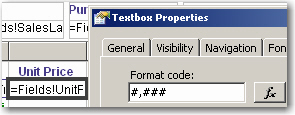
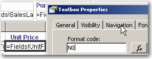
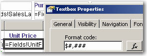
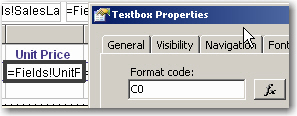
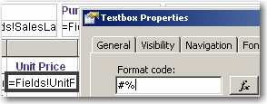
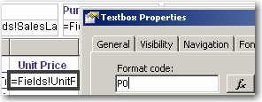

Currency formatting is not universal - therefore, it's crucial to adapt the formatting to match regional conventions.

<!--endintro-->

In Australia, one million is written this way: $1,000,000.00.
But in Brazil, one million is written that way: $1.000.000,00.

So, in order to be culturally sensitive, try and use regional friendly formatting.

::: bad  
  
:::

::: good  

:::

::: bad  
  
:::

::: good  

:::

::: bad  
  
:::

::: good  

:::
