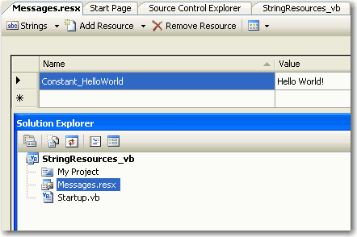

All messages are stored in one central place so it's easy to reuse. Furthermore, it is strongly typed - easy to type with IntelliSense in Visual Studio.

<!--endintro-->

```vbnet
Module Startup Dim HelloWorld As String = "Hello World!" Sub Main() Console.Write(HelloWorld)Console.Read() End Sub End Module
```

::: bad
Bad example of a constant message
:::

::: good\

:::

```vbnet
Module Startup Sub Main() Console.Write(My.Resources.Messages.Constant_HelloWorld) Console.Read() End Sub End Module
```

::: good
Good example of a constant message 
:::
