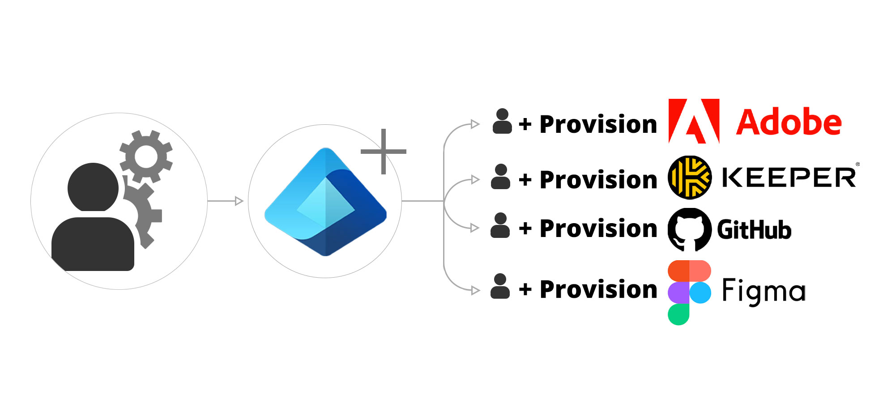
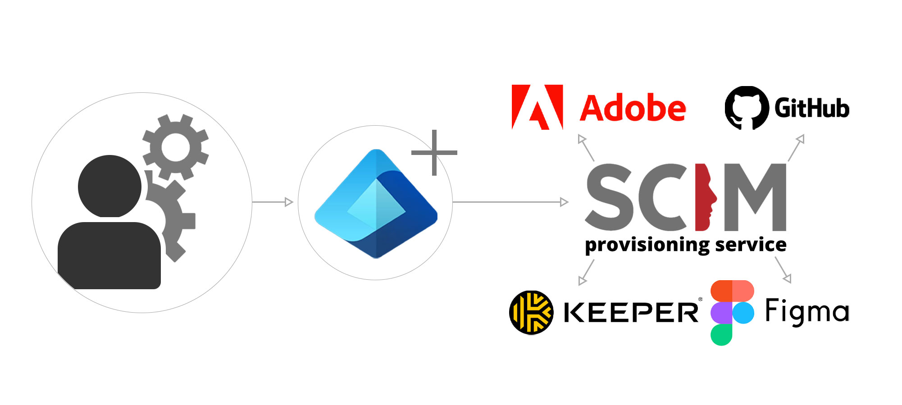

Leveraging SCIM (System for Cross-domain Identity Management) in conjunction with Entra ID (or whatever Identity provider you use) is crucial for efficient and secure identity synchronization across cloud-based applications and services.

<!--endintro-->

## Why Integrate SCIM with Azure AD?

Integrating SCIM with Azure Active Directory automates the process of managing user identities in cloud applications. This integration streamlines user creation, modification, and deletion, reducing manual errors, saving administrative time, and enhancing security.

### Bad Example

Relying solely on manual identity management processes in Azure Active Directory without SCIM integration. This manual approach is inefficient, prone to errors, and can lead to security risks due to inconsistent identity data across applications.

::: bad

:::

### Good Example

Implementing SCIM to automate user provisioning and deprovisioning across various cloud services. This ensures consistent identity data, improves security, and reduces the administrative burden.

::: good

:::
By integrating SCIM with Azure Active Directory, organizations can achieve a more streamlined, secure, and efficient approach to identity management across their cloud ecosystem.
