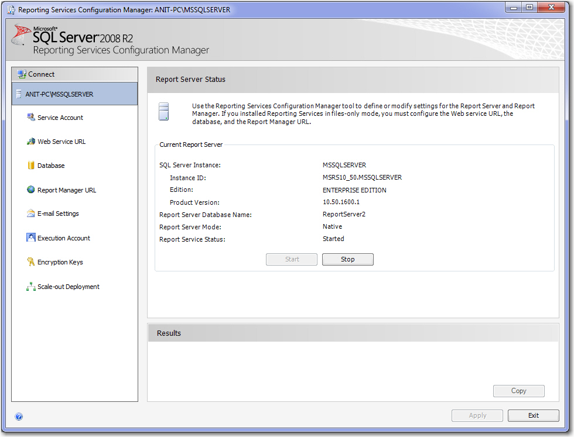
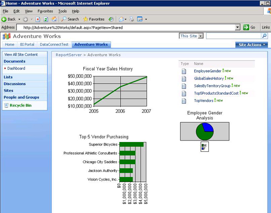

With the use of SharePoint 2010 Integration mode of Reporting, users can have following advantages:

<!--endintro-->

The users Can easily deploy data sources, reports to sharePoint document libraries instead of Report Manager.
The users can be much more self-sufficient with SharePoint.
Very easy one step configuration of the add-in
37 languages supported including bi-directional languages.
Accessing Reporting in local mode when Access Services is enabled.
Improved Report Preview experience with Report Builder 3.0 and edit sessions and deploy their reports to SharePoint document libraries, leveraging SharePoint for security.
The users can take advantage of the new version of Report Builder that came with SQL Server 2008 R2 and deploy their reports to SharePoint document libraries, leveraging SharePoint for security.

::: bad  
  
:::

::: good  
 
:::
