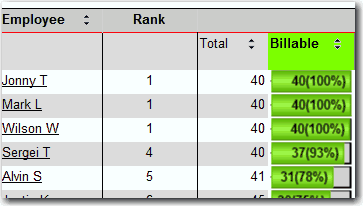

SQL Ranking functions are introduced since SQL 2005. With these handy functions, you can easily rank your data.

<!--endintro-->

```sql
	SQL Snippet
	SELECT Rank() Over(Order A.BillableTimeTotal Desc) As Rank
```

::: good  
 
:::
