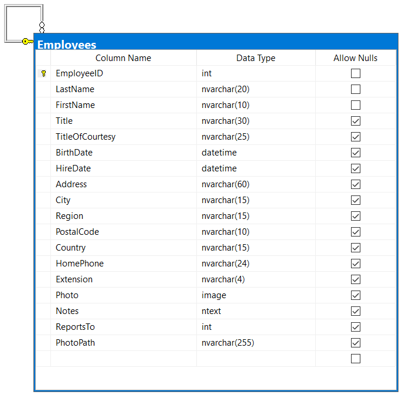
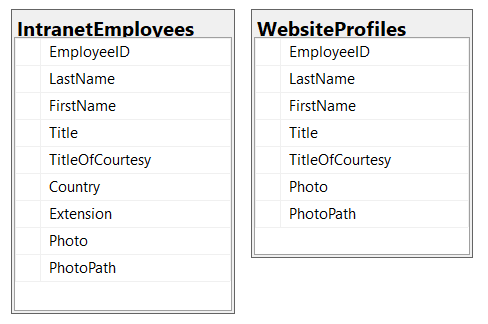

A view is a virtual table produced from executing a stored query on the database. Views don’t store any data as they retrieve the result set through a query. Users can interact with views similarly as they would with a normal table when retrieving data however limitations do exist when writing back to the result-set. Views can be used to simplify access to database result sets and provide more security options to administrators when granting access. More information can be found at [CREATE VIEW (Transact-SQL)](https://docs.microsoft.com/en-us/sql/t-sql/statements/create-view-transact-sql?view=sql-server-ver15)

<!--endintro-->


::: good
Advantages:  
:::

**1. Simplicity**

* Multiple tables can be joined and simplified into a single virtual table.
* Complex calculations, groupings and filters can be hidden from the user so that the results appear as a simple dataset.
* Views can be used to transparently partition data such as having Sales2019 and Sales2020 but both views read from the underlying Sales table.
* Duplication can be reduced in procedures and queries by using a common view.

 
 **2. Security** 

* Views can be used to provide a specific data set to a user while protecting the underlying tables.
* Permission management of tables cannot be limited to a row or a column, but it can be implemented simply through views.

 
 **3. Flexibility** 

* Once the view structure is determined, you can shield the impact of changes in the table structure on users.
* Modifying the column name of the source table can be solved by modifying the view, without impacting end users.
* Aliases can be used on column names to make them more readable and descriptive.
* Adding columns to the source table has no impact on the view.
* The ability to soft-delete records by filtering them with an IsDeleted column.

::: bad
Disadvantages:

:::
 **1. Performance** 

* Views can take longer to query than tables as they may contain complex functions or multi-table queries.

 **2. Dependencies** 

* Views depend on the underlying tables for its data, so if the structure of the tables change it may break the view.

  **3. Update Restrictions** 

* Depending on the complexity of the view, you may not be able to modify the data through the view to the underlying base tables.

### Modifying tables through views

In some cases, you can update the tables through a SQL view depending on its complexity. 
You can only update views with a single base table otherwise it may choose the incorrect base table to update.

```sql
INSERT INTO vwProductsNorthwind VALUES (@ItemName, @ItemCost);

UPDATE vwProductsNorthwind SET Cost = @ItemCost WHERE Id = @ItemId;

DELETE vwProductsNorthwind WHERE Id = @ItemId;
```


 **Figure: Example of an updatable view using a single base table
** <dd><p class="ssw15-rteElement-P">More complex views, such as a multi-table view can be used after the where clause in another update statement.</p></dd>


```sql
-- Create the products by category view
CREATE VIEW vwProductsByCategory
AS
SELECT p.Id, p.Name, p.Cost, p.OnSale, p.CategoryId
FROM Products p
JOIN Categories c
ON p.CategoryId = c.Id

-- Set all products from a particular category to be on sale
UPDATE Products
SET  OnSale = @OnSale
WHERE Id IN ( SELECT Id FROM  vwProductsByCategory WHERE CategoryName = @CategoryName )
```


 **Figure: Using a multi-table view after the when clause** 
### Example Scenario


So your business has an employees table as shown below that has detailed information about their name, birthdate, home phone, address and photo. This information is suitable for the payroll department but what you want to display employees names and photos on the website for public viewing. Or what If you want contact information such as extension number and country to be available on the company intranet?

 **Figure: Northwind traders employees table** 
You could create separate tables for each department, only supplying the required fields for each. 
This would also need an additional system to sync between the tables to ensure the information was kept up to date.


::: bad
Figure: Bad Example – Using tables and duplicating data  
:::

```sql
CREATE VIEW  vwIntranetEmployees AS  
SELECT EmployeeID, LastName, FirstName, Title, TitleOfCourtesy, Country, Extension, Photo, PhotoPath   
FROM Employees;  

CREATE VIEW  vwWebsiteProfiles AS  
SELECT EmployeeID, LastName, FirstName, Title, TitleOfCourtesy, Photo, PhotoPath
FROM Employees;
```

::: good
Figure: Good Example – Using views from the base table containing the source data
:::

Creating views of the employee table allows you to update the data in one source location such as payroll and all other departments will see the changes. It prevents the problem of stale data and allows more control over access to the data.
