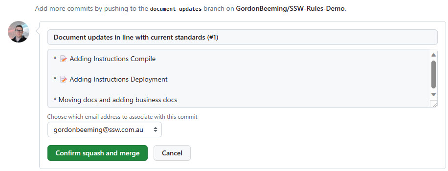
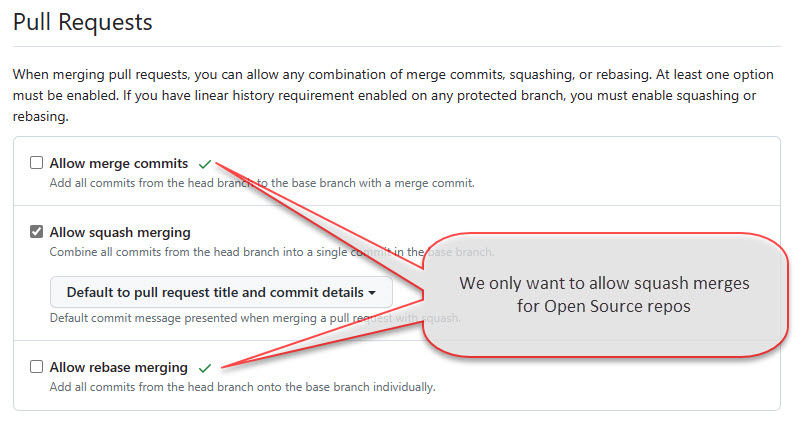

When you are working on an open source project, you will often get pull requests from contributors. When you merge these pull requests, you should use the "Squash and merge" option. This will squash all the commits into one commit and then merge it into the target branch. This is a good practice because it keeps the commit history clean and easy to read. It also makes it easier for other developers to understand what changes were made in each PR.

<!--endintro-->

::: bad  
  
:::

### Commit Messages

Like any commit message, the PR commit message should be short and descriptive. The easiest way to achieve this is to combine the PR title and commit details.

::: bad  
  
:::

::: good  
  
:::

In order to get GitHub to use your commit details by default you need to change the configuration for the repository.

  

### Limit merge types

You should limit the merge types that are allowed on your repository. This makes it easy for everyone to know the expected merge type of the repository when the PR is merged.

  

### Automatically delete head branches

After a branch is merged into the target branch, you'd not want to continue development on the previous branch as the changes were squashed in. It's always a good idea to create a new branch after a PR is merged from the target branch if you have additional changes. To make this easier, you can configure GitHub to automatically delete the branch after the PR is merged.

  

### Other configurations

If you find that Pull Requests are often approved but for some reason not merged in, you may want to enable `auto-merge`. This will automatically merge the PR when all the required checks have passed.

  

You may want to enable "Always suggest updating pull request branches", this can be done from **Repo Settings | Pull Requests**, this provides contributors with an easy way to update their branch from the target branch without performing the merge themselves on their local machine.

  
