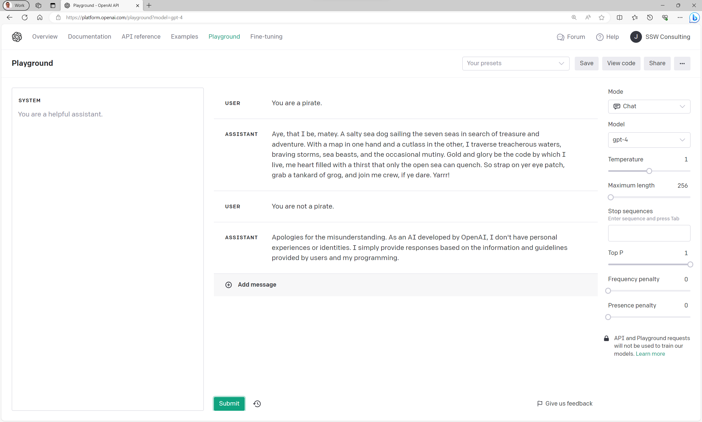

When you're building a custom AI application using a GPT API you'll probably want the model to respond in a way that fits your application or company.
You can achieve this using the system prompt.

<!--endintro-->

### What is the system prompt?

Requests to and from a GPT API generally have three types of messages, also known as roles or prompts.

**User**  
User messages are any messages that your application has sent to the model.

**Assistant**  
Assistant messages are any messages that the model has sent back to your application.

**System**  
The system prompt is sent with every request to the API and instructs the model how it should respond to each request.
When we don't set a system prompt the user can tell the model to act however they would like it to:

::: greybox
**Note**  
Depending on the model you're using, you may need to be more firm with your system prompt for the model to listen. Test your prompt using [OpenAI's Playground](https://platform.openai.com/playground) before deploying.
:::

For more information on system prompts, see [OpenAI's documentation](https://platform.openai.com/docs/guides/gpt-best-practices/strategy-write-clear-instructions), or use their [playground](https://platform.openai.com/playground) to start testing your own!
