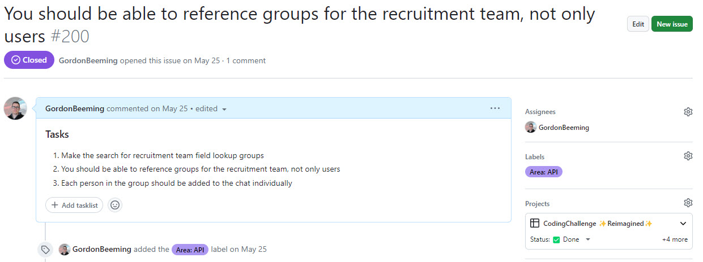
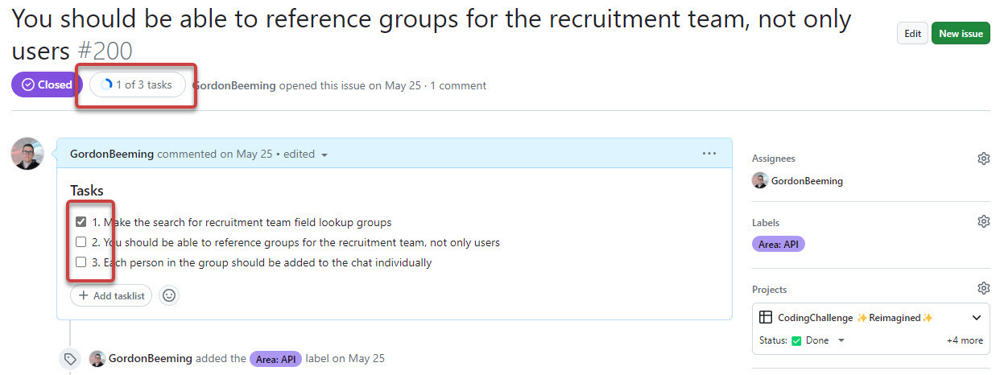
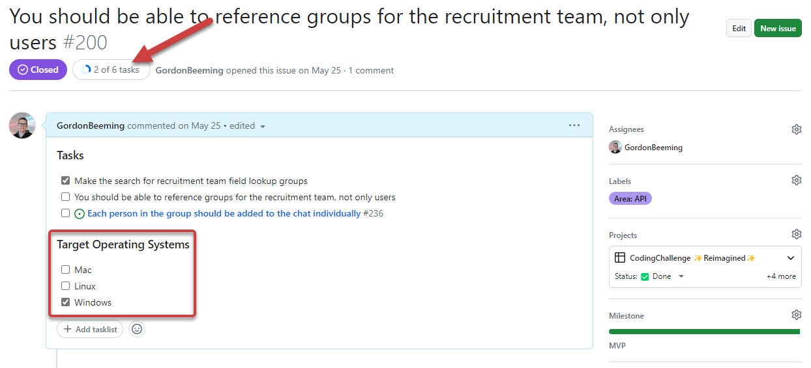
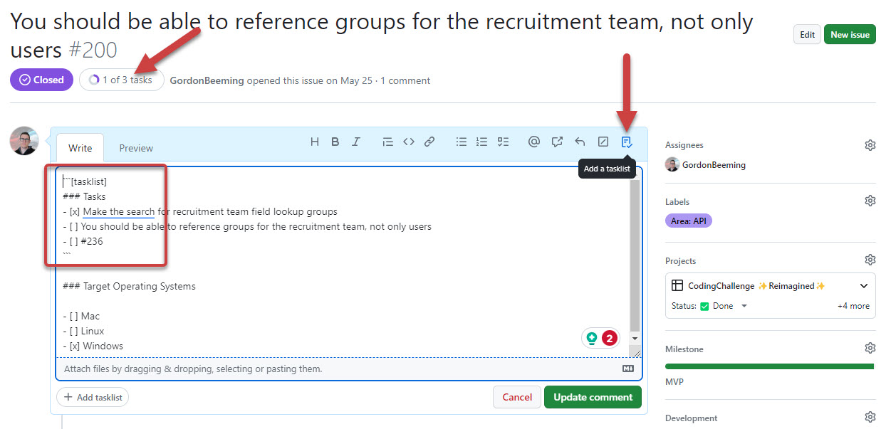
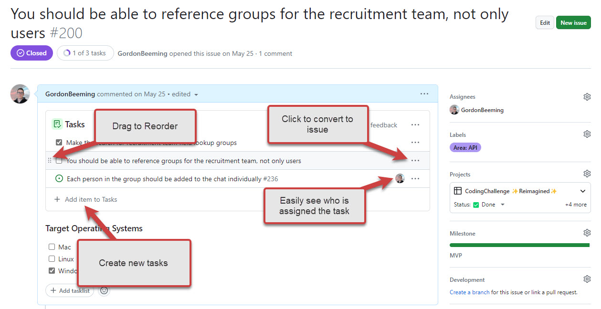

  
There are many ways to write tasks in PBIs, but the best way is to use tasklists. This allows you to see the progress of the PBI at a glance as well as avoid any unintentional tasks being tracked. Below is the different ways you could write tasks in PBIs.

<!--endintro-->

`youtube: https://www.youtube.com/watch?v=xESLL-dKCdg`
**Video: GitHub Tips - Why YOU should use tasklists (4 min)**

### Numbering tasks

When sending tasks in email, you might [number your tasks](/number-tasks-questions/) to make it clear what you want. 

Although this would work in PBIs, it's not the best way to do it in GitHub.

### Using checklists

You can use checkboxes in PBIs to create a checklist for tasks

![Figure: You can click the tasks toolbar button or simple type in a task which is recognized as "- \[ \]"](task-checklist.jpg)

This will show a visual que as to how many tasks you've completed for the PBI. 

::: ok

:::

These tasks are numbered, but if we were to re-order them we'd need to re-number them so the list makes sense again. A better approach to numbering tasks would be to convert a task into it's own issue, this allows you to detail it out further or have more in-depth conversations around the issue specifically.

::: good

:::

One of the downsides to using checklists is that any checkbox in the issue description would show up as a task. This means that if you had a checkbox in the description that wasn't a task, it would show up as a task. This is why we recommend using tasklists.

### Using tasklists (recommended)

Lastly you should use the tasklist for your tasks, this gives the same advantages as standard checklists without interference from other checkboxes. 

Besides the benefits described above, there's also the advantage of having a UI component built specifically to markup a tasklist.

You can see from the UI component there is a convenient button to add a task, easily see who is assigned to tasks; As well as a menu list of options to convert to issue, rename and remove tasks, all through the UI. This is great for team members who don't feel comfortable with markdown.
